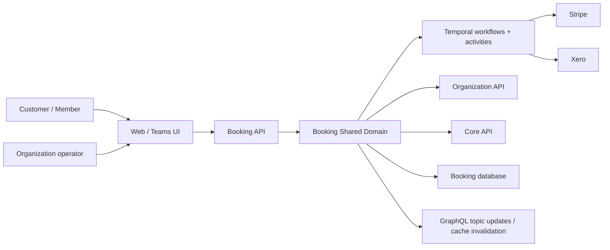
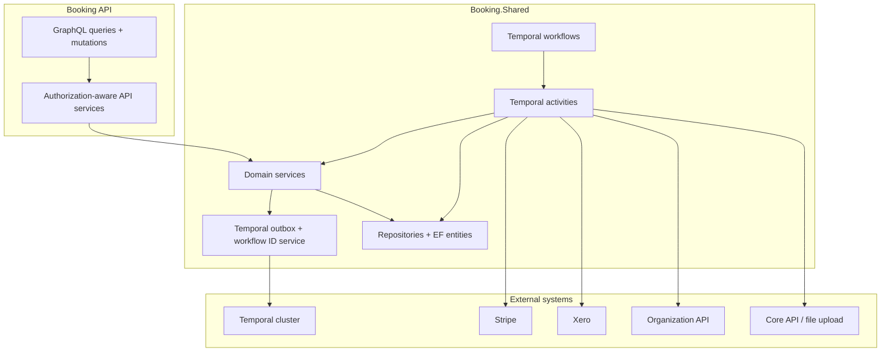
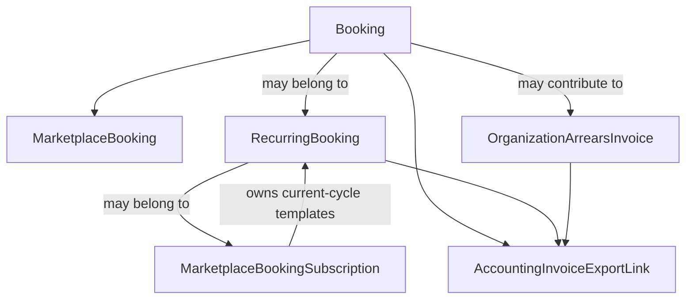
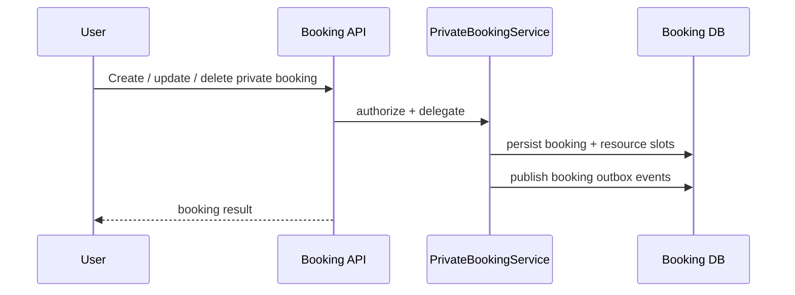
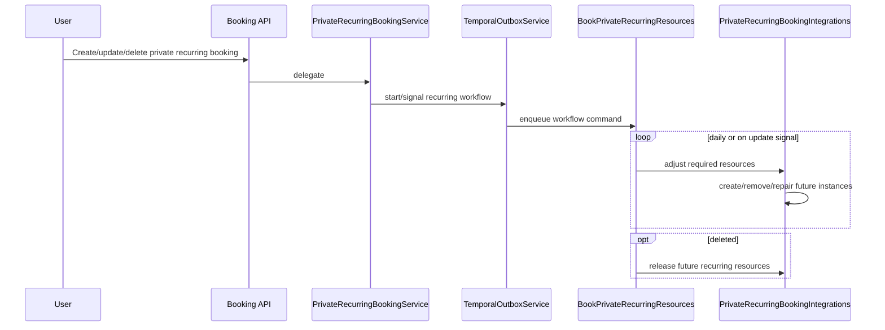
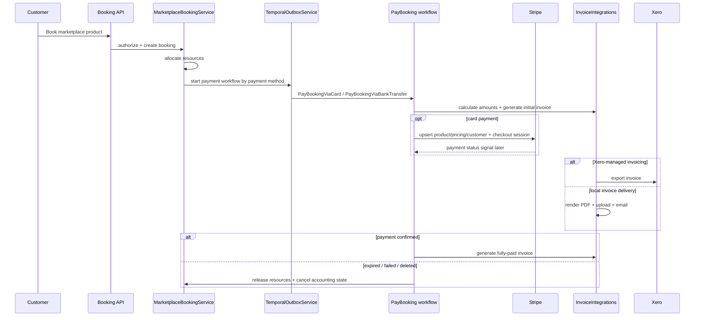
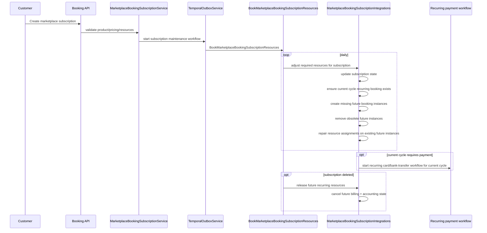
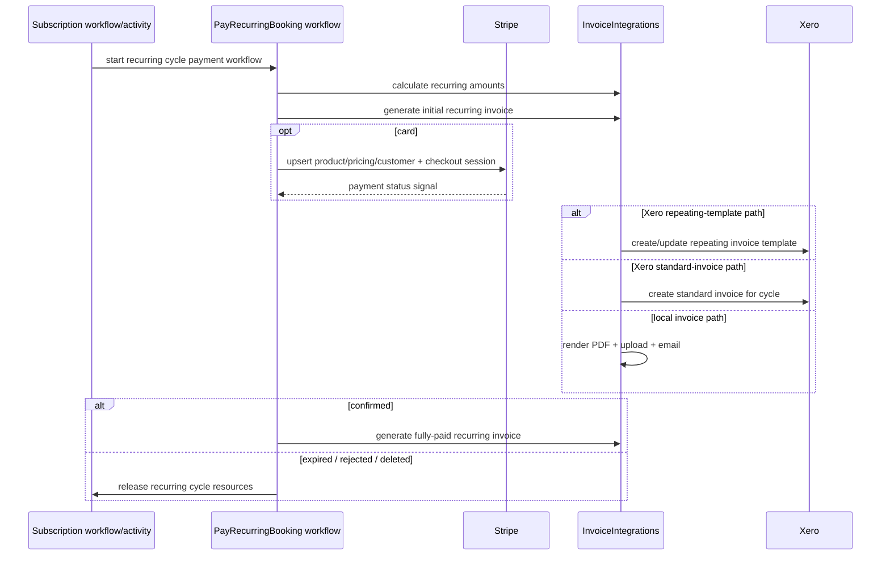
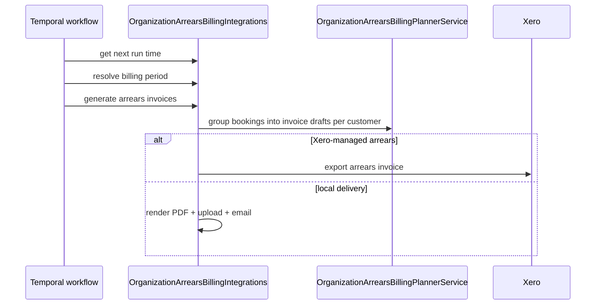
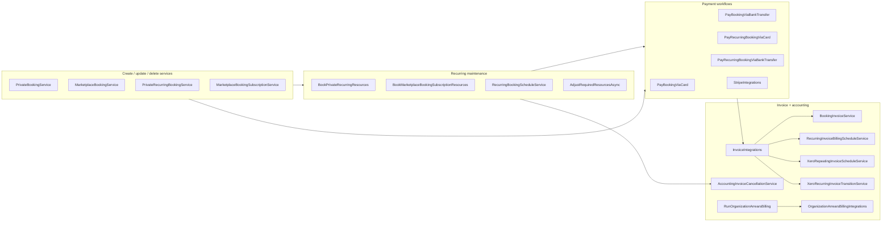

# Booking Domain Architecture

This document is a high-level architecture view of the Booking domain as it exists today.

It is intentionally C4-style rather than implementation-complete. The goal is to explain:

- how booking requests enter the domain
- how the domain separates private bookings, marketplace bookings, recurring bookings, and subscriptions
- how Temporal workflows drive payment, reconciliation, renewal, and cleanup
- how Stripe and Xero fit into the booking lifecycle
- how invoice generation, export, and cancellation work at a high level

## Scope

This document covers the booking domain surfaces under:

- `booking/apis/Booking.Api`
- `booking/shared/Booking.Shared`
- the booking-owned Temporal workflows and activities

It also references the external systems that the booking domain coordinates with:

- Stripe
- Xero
- Organization API
- Core API
- Temporal

## Core Concepts

- `Private booking`
    - An internal/non-marketplace booking.
    - Usually managed directly inside an organization context.

- `Marketplace booking`
    - A one-time customer-facing booking for a marketplace product.
    - Can require payment by card or bank transfer.

- `Recurring booking`
    - The persisted recurring schedule template used to materialize future booking instances.
    - Used for both private recurring bookings and marketplace recurring cycles.

- `Marketplace booking subscription`
    - The customer-facing auto-renewable marketplace construct.
    - Owns the current subscription state, renewal timing, and the recurring-booking instances created for each cycle.

- `Organization arrears invoice`
    - A billing-period invoice generated for in-arrears marketplace billing at the organization level.

- `Accounting invoice link`
    - The durable link between a local booking/invoice entity and external accounting state such as Xero.

Recurring Xero note:

- recurring marketplace billing always emits the first concrete invoice immediately
- Xero repeating templates are only used for later cycles when auto-renew is enabled or when the purchase cadence must
  be split by the organization billing cycle
- when a repeating template exists, it starts from the next billing boundary rather than the first billed cycle

## System Context

## Container View

## Responsibility Split

### Booking API

`booking/apis/Booking.Api` is the entry point for customer and operator actions.

It is responsible for:

- authentication and authorization checks
- GraphQL/API contracts
- loading the caller context
- delegating to booking shared services

It is not the main owner of orchestration logic.

### Booking.Shared Services

`booking/shared/Booking.Shared/Services` owns the transactional booking logic:

- create/update/delete bookings
- create/update/delete recurring bookings
- create/delete marketplace subscriptions
- resource assignment and repair
- invoice rendering
- invoice payment terms
- Xero export policy and accounting-link state

### Temporal Workflows

`booking/shared/Booking.Shared/Workflows` owns long-running orchestration:

- waiting for payment expiry
- reacting to payment status signals
- daily reconciliation of recurring schedules
- subscription renewal progression
- organization arrears billing runs
- accounting state maintenance

### Temporal Activities

`booking/shared/Booking.Shared/Activities` is where workflows touch services and external systems:

- Stripe checkout/product/customer actions
- Xero invoice export and sync
- booking amount calculation
- invoice generation/upload/email
- recurring subscription reconciliation
- organization arrears invoice generation

## Booking Model Map

## Main Runtime Flows

## 1. Private booking

Private bookings are direct bookings without the marketplace payment/invoicing orchestration.

Key notes:

- private bookings allocate resources transactionally
- no Stripe workflow is involved
- no marketplace invoice/export path is involved

## 2. Private recurring booking

Private recurring bookings are maintained by a dedicated Temporal workflow.

Key notes:

- the workflow wakes daily
- updates also signal the workflow immediately
- overridden recurring instances are intentionally excluded from automatic repair/removal

## 3. Marketplace one-time booking

Marketplace bookings add payment, invoice, and external-provider orchestration on top of booking/resource allocation.

Supported payment modes:

- card
- bank transfer

Supported invoice delivery modes:

- local PDF/email by Skedular
- exported standard invoice via Xero

## 4. Marketplace subscription and auto-renewal

Marketplace subscriptions are the main auto-renewable path.

Important behavior:

- the workflow wakes daily, not continuously
- renewal is driven by `NextRenewalAt` and the product pricing cadence
- the workflow creates a new recurring cycle only when the subscription is still eligible to continue
- if matching pricing/product configuration can no longer be found, renewal fails instead of silently mutating to
  another product

## 5. Recurring cycle payment and invoicing

Each marketplace subscription cycle has its own payment workflow.

## 6. Organization in-arrears billing

Organization-level in-arrears billing is a separate orchestration path from subscription renewal.

Key distinction:

- organization arrears billing groups eligible bookings into billing-period invoices
- it is separate from one-time marketplace checkout and separate from recurring subscription cycle payments

## Billing and invoice policy

## Recurring billing schedule

The recurring billing schedule is provider-agnostic inside Booking.Shared.

The booking domain first decides:

- what cadence invoices should be emitted on
- whether a longer purchase cadence should be split by the organization billing cycle
- what amount each installment should carry

That decision is owned by:

- `RecurringInvoiceBillingScheduleService`

Then provider-specific services consume that decision:

- local recurring invoice generation
- standard Xero invoice export
- Xero repeating-invoice export when representable

## Payment terms

Invoice due dates are organization-owned payment terms.

The booking domain applies those terms to:

- local invoice PDFs
- standard Xero invoices
- Xero repeating invoice schedules
- organization arrears invoices

## Stripe integration

Stripe is used for hosted checkout for card-based marketplace flows.

The booking domain uses Stripe for:

- upserting product pricing
- upserting Stripe customers
- creating hosted checkout sessions
- receiving payment status back through booking-owned signal paths

Stripe does not own resource booking or booking state. Temporal workflows do.

## Xero integration

Xero is used as an accounting/export provider, not as the source of truth for booking state.

The booking domain uses Xero for:

- standard invoice export
- repeating invoice templates for supported recurring shapes
- organization arrears invoice export
- payment status/accounting-state sync
- cancellation of live exported invoices/templates when bookings or recurring cycles are cancelled

Important constraints:

- Xero repeating invoices are only used when the recurring schedule can be represented safely
- unsupported recurring shapes fall back to standard per-cycle invoices
- local booking/subscription cancellation is authoritative even if Xero cleanup later requires retry or manual attention

## Cancellation model

Cancellation is handled in two layers:

1. local booking/subscription state
2. accounting/export side effects

Immediate cancellation:

- stops future billing
- frees future resources/bookings
- preserves past bookings
- attempts to cancel live Xero invoices/templates

Cancel at period end:

- keeps the current cycle intact
- disables auto-renew
- prevents the next cycle from being materialized
- shows the subscription as scheduled to stop

Already-issued invoices remain historical records. Cancellation stops future billing; it does not imply refund or
invoice reversal.

## Current high-level component map

## Known boundaries and tradeoffs

- Subscription resource reconciliation is daily, not fully reactive.
- Overridden recurring instances are intentionally excluded from automatic repair/removal.
- Local booking/subscription state is the source of truth; external accounting providers are downstream integrations.
- Xero repeating templates are only used for supported recurring shapes; not every pricing cadence maps cleanly.
- Already-issued invoices are not retracted when a booking or subscription is cancelled.

## Reading Guide

If you want to drill deeper after this document:

- customer/operator API entry points:
    - `booking/apis/Booking.Api/Services`
- transactional domain logic:
    - `booking/shared/Booking.Shared/Services`
- long-running orchestration:
    - `booking/shared/Booking.Shared/Workflows`
- side effects and provider integrations:
    - `booking/shared/Booking.Shared/Activities`
- test coverage for the most important behaviors:
    - `booking/shared/Booking.Shared.UnitTests`
    - `booking/apis/Booking.Api.UnitTests`
