# Booking Runtime Flows

This document is the visual companion
to [booking-domain-architecture.md](/Users/morteza/projects/github.com/unityhubio/unityhubio/booking/domain/docs/architecture/booking-domain-architecture.md).

It is intentionally diagram-first and focuses on how the booking domain behaves at runtime.

## 1. Booking Type Routing

This is the first split in the domain.

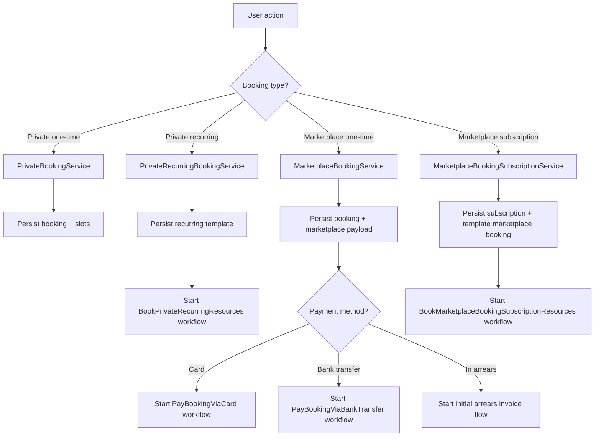

## 2. Marketplace One-Time Booking: Card

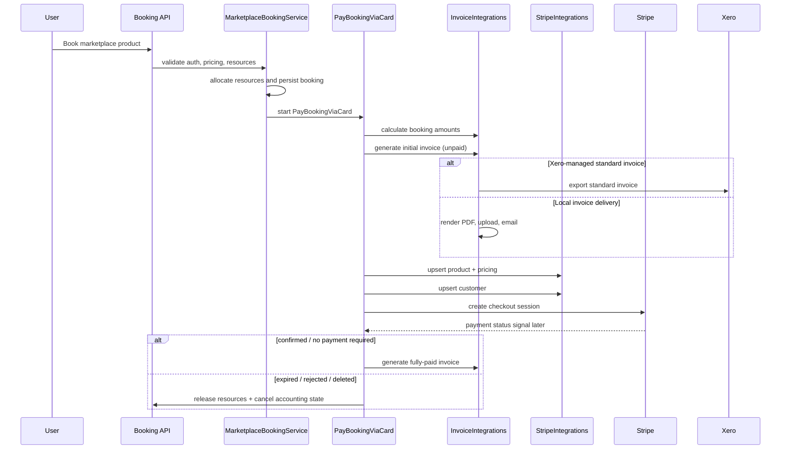

## 3. Marketplace One-Time Booking: Bank Transfer

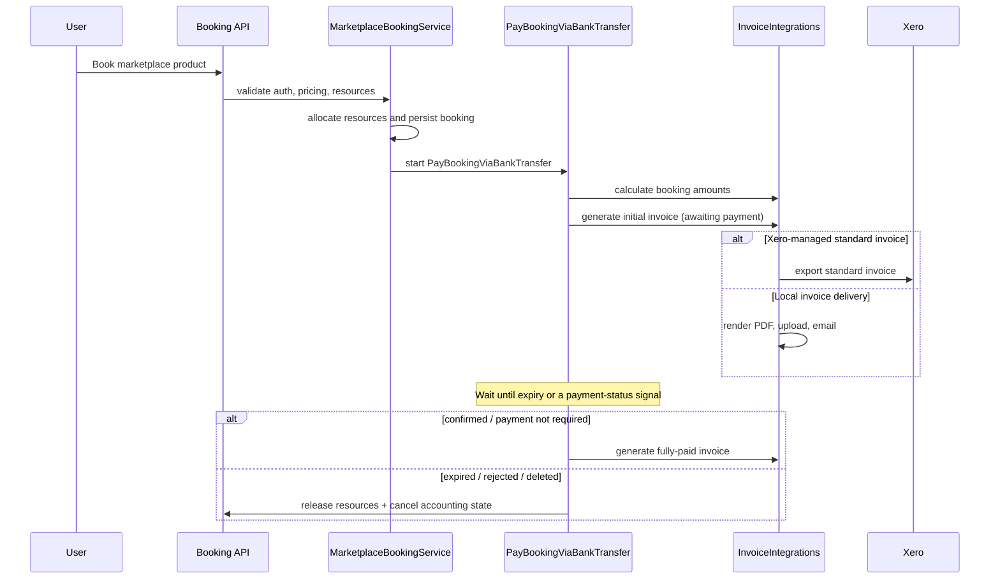

## 4. Private Recurring Booking Loop

This is the non-marketplace recurring path.

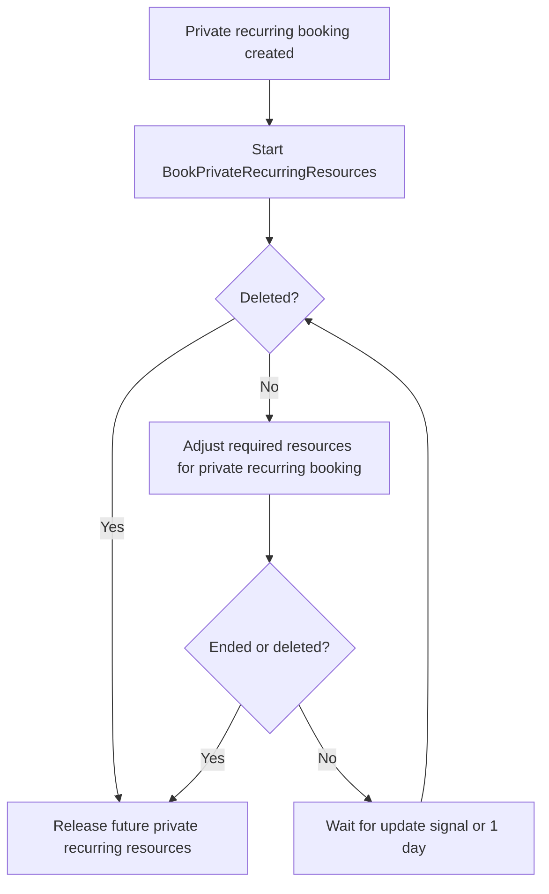

## 5. Marketplace Subscription: Daily Maintenance Loop

This is the core auto-renewal and reconciliation loop.

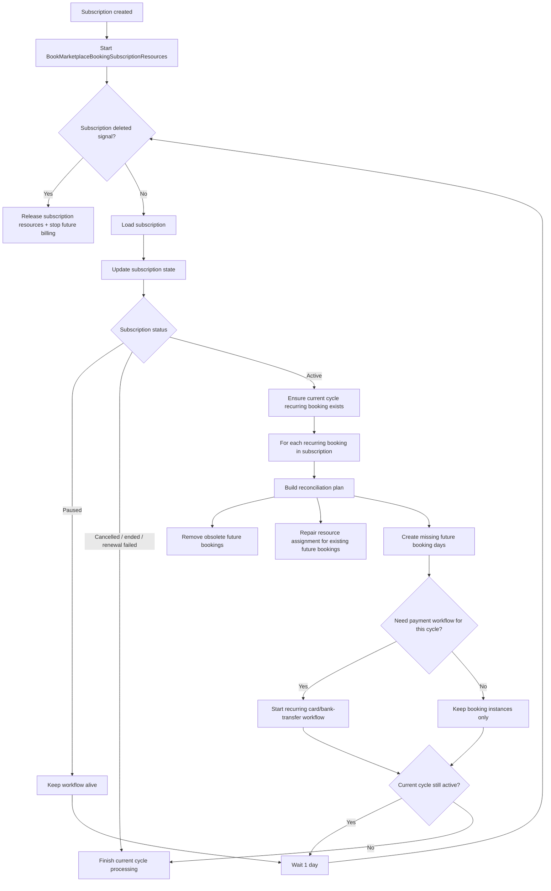

## 6. Marketplace Subscription Renewal Decision

This shows how the subscription transitions from one cycle to the next.

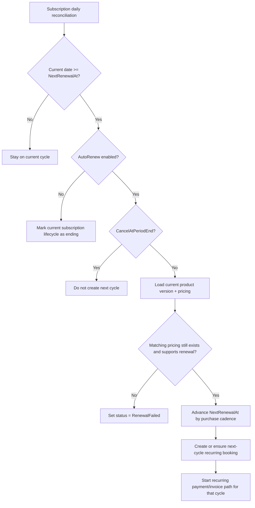

## 7. Recurring Cycle Billing Decision

This is the booking-owned decision that sits before invoice delivery.

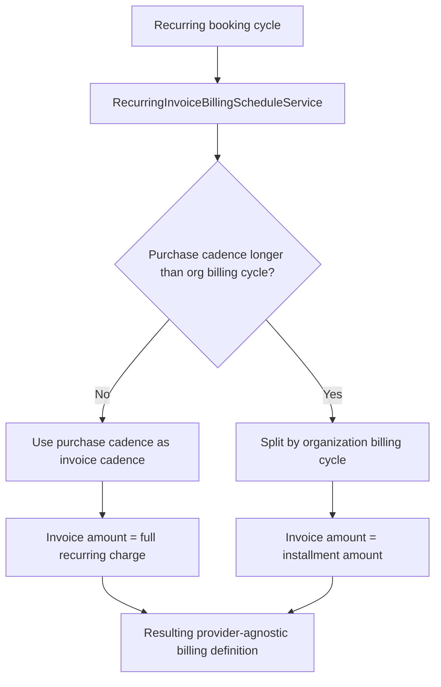

## 8. Recurring Invoice Delivery Decision

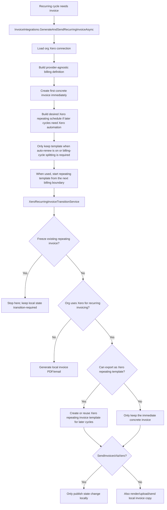

## 9. Organization In-Arrears Billing

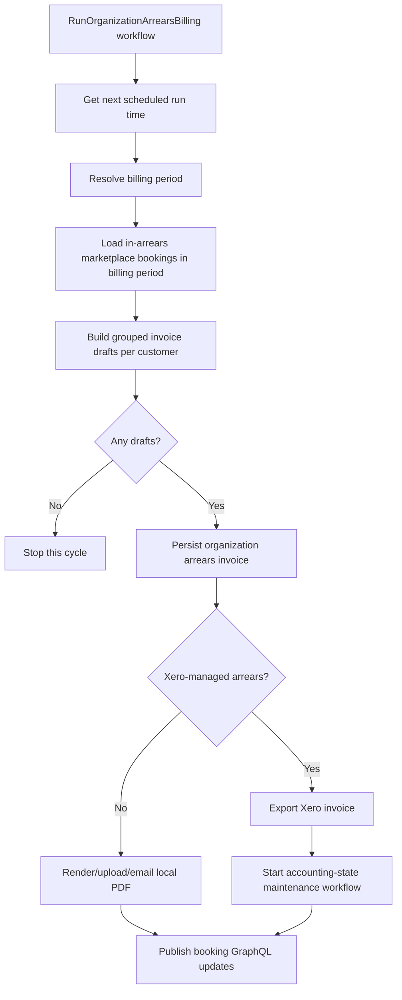

## 10. Cancellation Modes

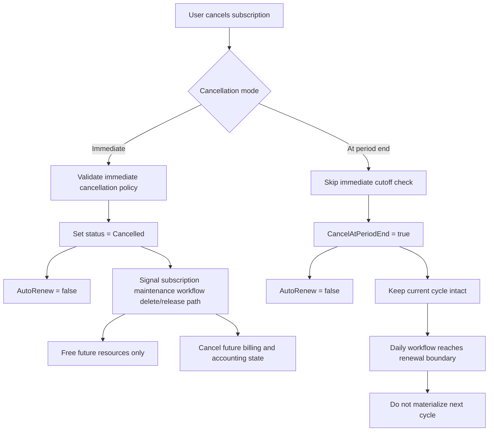

## 11. Booking / Invoice Cancellation Side Effects

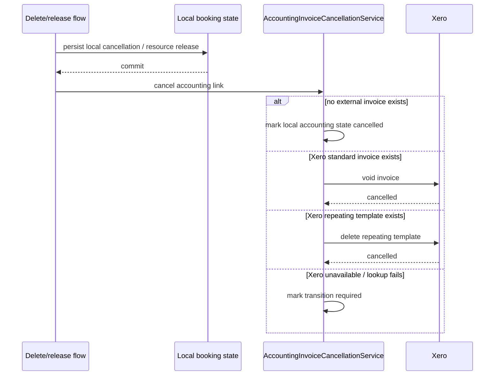

## 12. Resource Repair and Known Gap

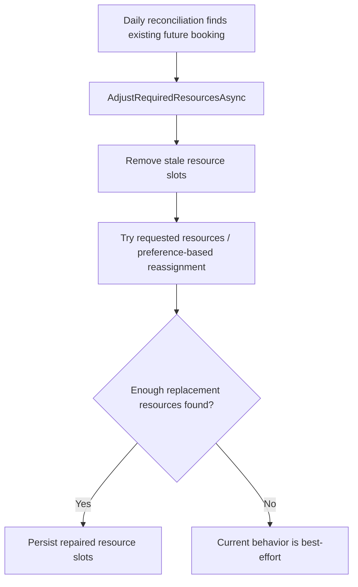

Current known gap:

- resource repair still does not hard-fail when the full required resource count cannot be reassigned

## 13. Runtime Ownership Summary

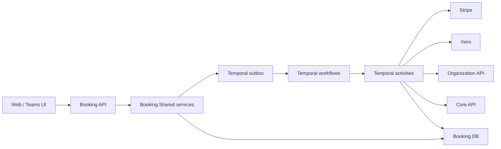
