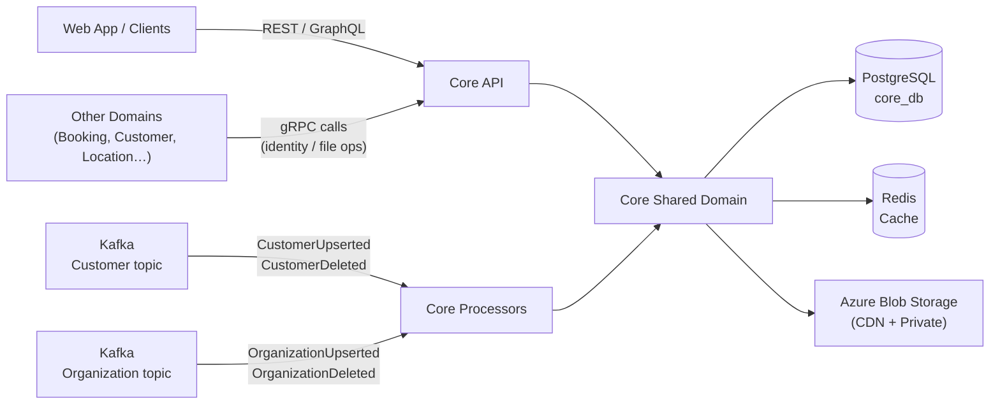
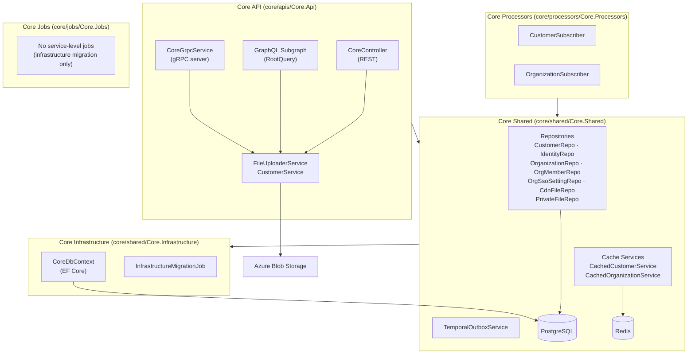
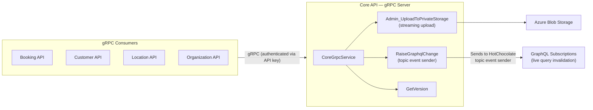
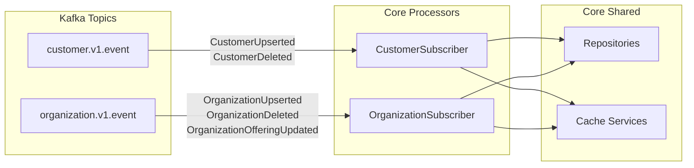
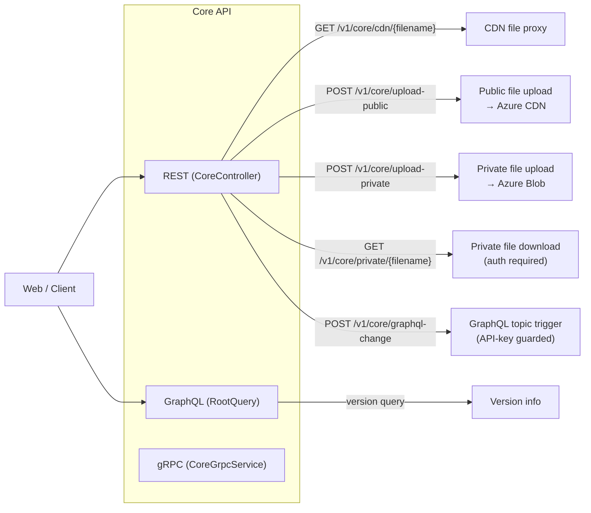

# Core Domain Architecture

This document is a high-level architecture view of the Core domain as it exists today.

It is intentionally C4-style rather than implementation-complete. The goal is to explain:

- what data Core owns and why
- how Core's gRPC server is consumed by other domains
- how Core stays in sync with the rest of the platform via Kafka events
- how file storage (CDN and private) flows through the domain
- how SSO settings are managed and replicated

## Scope

This document covers the Core domain surfaces under:

- `core/apis/Core.Api`
- `core/shared/Core.Shared`
- `core/shared/Core.Infrastructure`
- `core/processors/Core.Processors`
- `core/jobs/Core.Jobs`

It also references the external systems that the Core domain coordinates with:

- Azure Blob Storage (CDN and private file storage)
- PostgreSQL
- Redis (cache)
- Kafka (event consumption)
- Other domains that call Core via gRPC

## Purpose and Scope

Core is the **identity and file source of truth** for the Skedular platform.
It owns the canonical records for:

- **Customers** — the platform-level user account, replicated from auth/identity events.
- **Identities** — email-verified provider credentials linked to a customer.
- **Organizations** — workspace tenants, including custom-domain and SSO settings.
- **Organization members** — the link between a customer and an organization.
- **CDN files** — publicly accessible files uploaded through the Core API.
- **Private files** — privately stored files accessible only to authenticated callers.
- **Organization SSO settings** — Azure AD / Entra SAML federation metadata per organization.

No domain-specific business logic lives here. Core is intentionally thin — it stores, replicates,
and serves identity and file data to the rest of the platform.

## System Context

## Component Map

## Model Catalogue

| Model | Project | Description |
|---|---|---|
| `Customer` | `Core.Shared` | Root aggregate for a platform user. Has `Type` (e.g. member, operator) and collections of Identities, OrganizationMembers, and files. Soft-deletable. |
| `Identity` | `Core.Shared` | An auth provider credential (email + verified flag) linked to a Customer. |
| `Organization` | `Core.Shared` | A workspace tenant. Holds `CustomDomain`, `Type`, `IsOwnershipVerified`, and optional SSO settings. |
| `OrganizationMember` | `Core.Shared` | Join record linking a Customer to an Organization with a `Role` and `Status`. |
| `OrganizationSsoSetting` | `Core.Shared` | SAML/Azure AD federation metadata: `EntityId`, `LoginUrl`, `AppFederationMetadataUrl`, `IsActive`. |
| `CdnFile` | `Core.Shared` | Metadata record for a publicly accessible CDN-hosted file. Linked to a Customer. |
| `PrivateFile` | `Core.Shared` | Metadata record for a privately stored file. Linked to a Customer. |

All aggregate roots extend `ReplicatedEntityBaseWithDeleted` (from `Enterprise.Shared.Database`), which provides
`Id`, `CreatedAt`, `UpdatedAt`, `DeletedAt`, and `EventRaisedAt` for idempotent event replay.

## gRPC Server — How Other Domains Consume Core

Core exposes a gRPC server (`CoreGrpcService`) that other domains call for cross-cutting operations.
The proto definition lives under `api-definitions/grpc/skedular/`.

Key gRPC operations:

| Method | Direction | Purpose |
|---|---|---|
| `RaiseGraphqlChange` | Other domains → Core | Triggers a GraphQL subscription topic event for live-query invalidation. Guarded by API key. |
| `Admin_UploadToPrivateStorage` | Other domains → Core | Streams a binary upload to private Azure Blob Storage. Returns a file reference. |
| `GetVersion` | Other domains → Core | Health / version check. |

## Kafka Event Subscriptions (Processors)

Core Processors consume two Kafka topics to keep their replicated read-model up to date.

### CustomerSubscriber

Handles `CustomerUpserted` and `CustomerDeleted` events.

- **Upserted**: upserts the Customer entity, diffs and rebuilds the Identity collection, then invalidates the Redis
  customer cache.
- **Deleted**: soft-deletes the Customer and invalidates the Redis cache.
- **Idempotency**: compares `EventRaisedAt` timestamps; ignores events older than the last processed state.

### OrganizationSubscriber

Handles `OrganizationUpserted`, `OrganizationDeleted`, and `OrganizationOfferingUpdated` events.

- **Upserted**: merges the Organization entity, rebuilds OrganizationMember and OrganizationSsoSetting child
  collections, then updates the Redis organization cache by ID and custom domain.
- **Deleted**: removes OrganizationMembers, clears `CustomDomain`, soft-deletes the Organization, and invalidates the
  Redis cache.
- **OrganizationOfferingUpdated**: currently a no-op placeholder for future use.

## REST and GraphQL API Surface

## Reading Guide

| You want to understand… | Start here |
|---|---|
| Entity shapes and DB constraints | `core/shared/Core.Shared/Database/Entities/` |
| Repository query patterns | `core/shared/Core.Shared/Repositories/` |
| How events are consumed and replicated | `core/processors/Core.Processors/Subscribers/` |
| How the gRPC server is implemented | `core/apis/Core.Api/Grpc/CoreGrpcService.cs` |
| File upload / CDN flow | `core/apis/Core.Api/Services/FileUploaderService.cs` |
| Cache invalidation patterns | `core/shared/Core.Shared/Services/Cache/` |
| Database migrations | `core/shared/Core.Infrastructure/` |
| GraphQL schema | Run `scripts/generate-graphql.sh` and inspect `core/apis/Core.Api/schema.graphql` |
