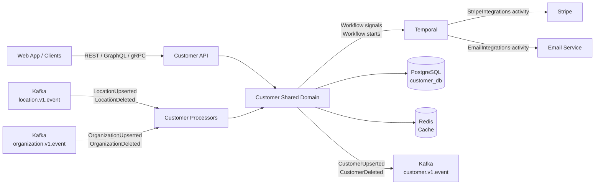
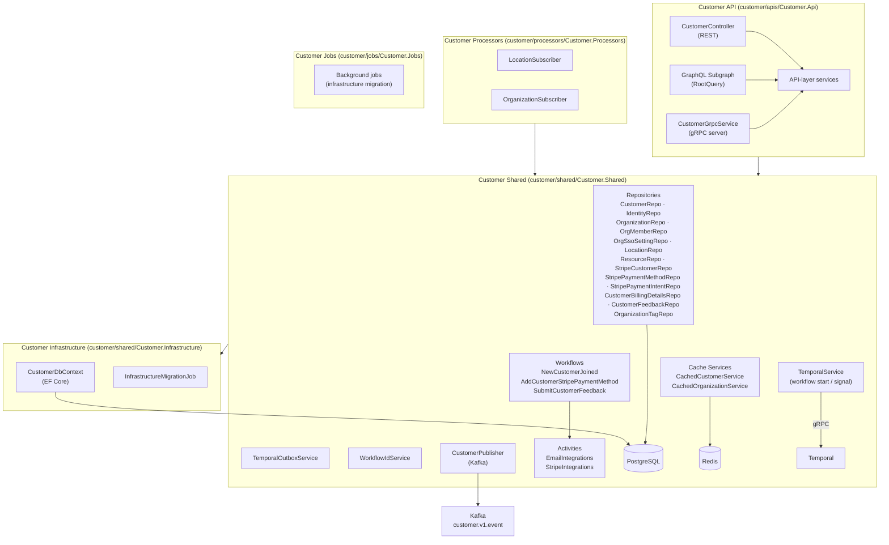
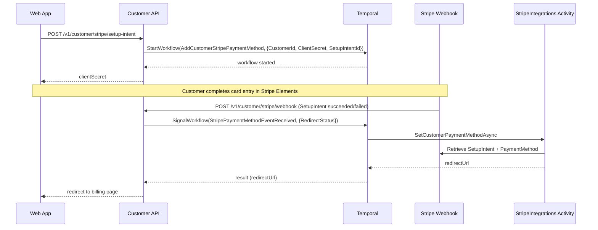
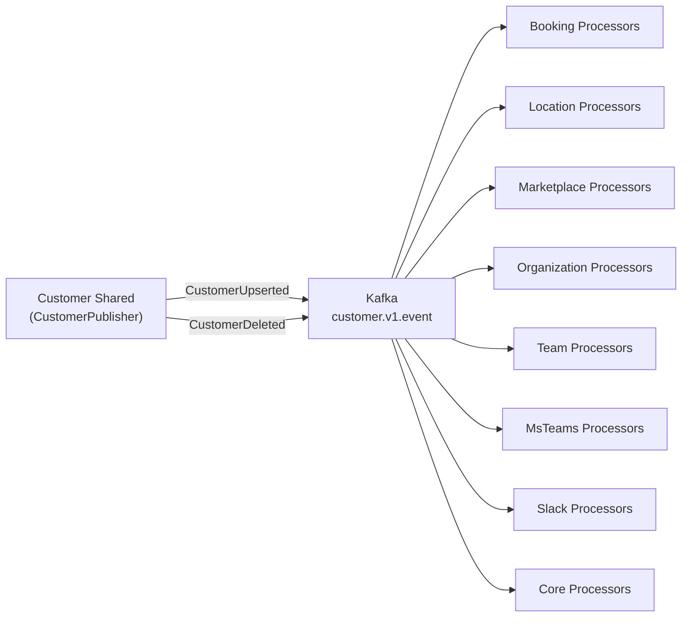
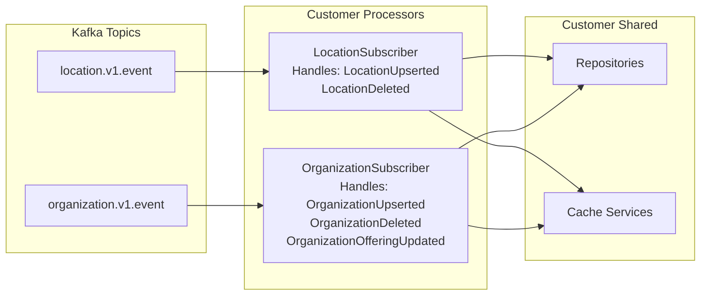
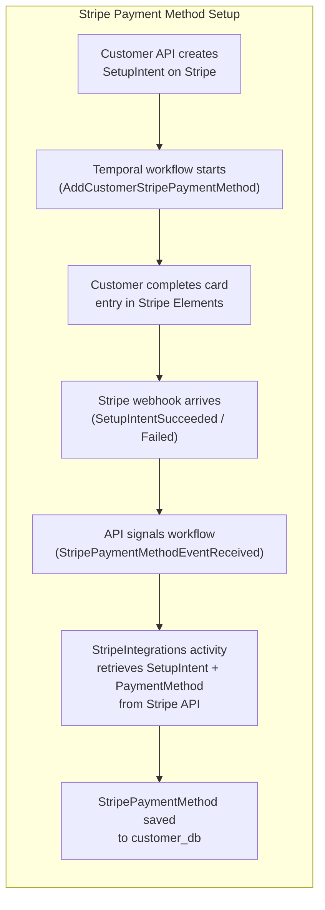

# Customer Domain Architecture

This document is a high-level architecture view of the Customer domain as it exists today.

It is intentionally C4-style rather than implementation-complete. The goal is to explain:

- what data the Customer domain owns
- how onboarding flows are driven by Temporal workflows
- how Stripe payment-method setup is coordinated as a durable workflow
- how customer feedback submission is handled
- how Customer events flow out to other domains
- how Customer Processors keep the local read-model in sync with Location and Organization events

## Scope

This document covers the Customer domain surfaces under:

- `customer/apis/Customer.Api`
- `customer/shared/Customer.Shared`
- `customer/shared/Customer.Infrastructure`
- `customer/processors/Customer.Processors`
- `customer/jobs/Customer.Jobs`

It also references the external systems that the Customer domain coordinates with:

- Stripe (payment method setup)
- Email service (onboarding and feedback notifications)
- Temporal (durable workflow execution)
- Kafka (event publication and consumption)
- PostgreSQL
- Redis (cache)

## Purpose and Scope

Customer is the **customer profile and onboarding domain**. It owns the authoritative customer record for the
platform, including:

- **Customer profiles** — name, onboarding state, personal information visibility, preferred locations/resources/tags.
- **Identities** — email-verified credentials replicated from auth events.
- **Organization memberships** — the link between a customer and each organization they belong to.
- **Stripe records** — StripeCustomer, StripePaymentMethod, and StripePaymentIntent entities owned by Customer.
- **Customer billing details** — address and company information used for invoice generation.
- **Customer feedback** — in-app feedback submissions with channel metadata.
- **Replicated location and resource data** — local copies of Location/Resource from the Location domain used for
  preference matching.

Customer is the **source of truth for customer-related Kafka events** (`customer.v1.event`). All other domains that
need customer data consume those events rather than calling Customer directly.

## System Context

## Component Map

## Model Catalogue

| Model | Project | Description |
|---|---|---|
| `Customer` | `Customer.Shared` | Root aggregate. Owns `IsOnboardingDone`, preferred locations/resources/tags, and default organization. |
| `Identity` | `Customer.Shared` | Auth provider credential (email + verified) linked to a customer. |
| `Organization` | `Customer.Shared` | Replicated workspace tenant. Holds `CustomDomain`, `Type`, `IsOwnershipVerified`. |
| `OrganizationMember` | `Customer.Shared` | Join record: customer ↔ organization, with `Role` and `Status`. |
| `OrganizationSsoSetting` | `Customer.Shared` | SAML/Azure AD federation metadata replicated from Organization events. |
| `OrganizationTag` | `Customer.Shared` | Tag defined by an organization (name, type, color). Customers can list preferred tags. |
| `Location` | `Customer.Shared` | Replicated location record from the Location domain. Linked to an organization. |
| `Resource` | `Customer.Shared` | Replicated resource record (e.g. a bookable room) nested under a location. |
| `StripeCustomer` | `Customer.Shared` | Stripe customer ID linked to a local customer record. |
| `StripePaymentMethod` | `Customer.Shared` | Saved card details (brand, last4, expiry, fingerprint) from a completed Stripe setup intent. |
| `StripePaymentIntent` | `Customer.Shared` | Stripe payment intent record linked to a payment method. |
| `CustomerBillingDetails` | `Customer.Shared` | Billing address and company name used on invoices. |
| `CustomerFeedback` | `Customer.Shared` | In-app feedback submission (content, channel: Web/Slack/MsTeams). |

## Temporal Workflows

The Customer domain uses Temporal for three durable operations.
Workflow IDs are generated through `WorkflowIdService` to ensure deterministic deduplication.

```mermaid
flowchart TD
    subgraph WF1["NewCustomerJoined workflow"]
        NCI["Input: CustomerId"]
        NCI --> NCA["Activity: EmailIntegrations\nSendNewCustomerJoinedEmailAsync"]
        NCA --> NCE["Email sent to\nconfigured receivers"]
    end

    subgraph WF2["AddCustomerStripePaymentMethod workflow"]
        SMI["Input: CustomerId\nClientSecret\nSetupIntentId"]
        SMI --> SMW["Wait up to 30 min\nfor Stripe webhook signal"]
        SMW -->|"signal: StripePaymentMethodEventReceived"| SMA["Activity: StripeIntegrations\nSetCustomerPaymentMethodAsync"]
        SMA -->|"redirectStatus == succeeded"| SavePM["Retrieve SetupIntent + PaymentMethod\nSave StripePaymentMethod to DB\nReturn success redirect URL"]
        SMA -->|"redirectStatus != succeeded"| FailPM["Return failure redirect URL"]
        SMW -->|"timeout (30 min)"| Fail["ApplicationFailureException"]
    end

    subgraph WF3["SubmitCustomerFeedback workflow"]
        SFI["Input: CustomerFeedbackId"]
        SFI --> SFA["Activity: EmailIntegrations\nSendCustomerFeedbackReceivedEmailAsync"]
        SFA --> SFE["Email sent to\nconfigured receivers\nwith channel + customer details"]
    end
```

### Workflow Detail

| Workflow | Trigger | Activities | Timeout / Retry |
|---|---|---|---|
| `NewCustomerJoined` | Customer completes onboarding | `SendNewCustomerJoinedEmailAsync` | StartToClose: 1 min · MaxAttempts: 3 |
| `AddCustomerStripePaymentMethod` | Customer initiates Stripe setup intent | `SetCustomerPaymentMethodAsync` | WaitCondition: 30 min · StartToClose: 30 s · MaxAttempts: 3 |
| `SubmitCustomerFeedback` | Customer submits in-app feedback | `SendCustomerFeedbackReceivedEmailAsync` | StartToClose: 1 min · MaxAttempts: 3 |

### AddCustomerStripePaymentMethod — Signal Flow

## Event Publication

Customer domain publishes to `customer.v1.event` via `CustomerPublisher`.

Event types published:

| Event type | Payload | When emitted |
|---|---|---|
| `CustomerUpserted` | Full customer state including identities | Customer created or updated |
| `CustomerDeleted` | Customer ID + metadata | Customer soft-deleted |

Events include Kafka key `{ CustomerId }` and metadata carrying `DomainSource`, `AppSource`,
`CorrelationId`, and event `Type`.

## Kafka Event Subscriptions (Processors)

Customer Processors consume two topics to keep the local read-model aligned with Location and Organization data.

### LocationSubscriber

Handles `LocationUpserted` and `LocationDeleted` events from the Location domain.

- **Upserted**: upserts the local Location entity (including nested Resources) to enable preference matching.
- **Deleted**: soft-deletes the local Location replica.
- **Idempotency**: guards via `EventRaisedAt` timestamp comparison.

### OrganizationSubscriber

Handles `OrganizationUpserted`, `OrganizationDeleted`, and `OrganizationOfferingUpdated` events.

- **Upserted**: merges Organization, rebuilds OrganizationMember and OrganizationSsoSetting children, invalidates
  cache.
- **Deleted**: removes members, clears custom domain, soft-deletes Organization, invalidates cache.
- **OrganizationOfferingUpdated**: no-op placeholder.

## Stripe Integration

The Customer domain owns all Stripe-facing persistence:

| Entity | Stripe concept |
|---|---|
| `StripeCustomer` | Stripe Customer object (`cus_…`) |
| `StripePaymentMethod` | Stripe PaymentMethod (`pm_…`) confirmed via SetupIntent |
| `StripePaymentIntent` | Stripe PaymentIntent (`pi_…`) for charge tracking |

Stripe API calls are wrapped in Temporal activities, providing automatic retries and durable execution.

## Reading Guide

| You want to understand… | Start here |
|---|---|
| Entity shapes and DB constraints | `customer/shared/Customer.Shared/Database/Entities/` |
| Repository query patterns | `customer/shared/Customer.Shared/Repositories/` |
| Temporal workflow implementations | `customer/shared/Customer.Shared/Workflows/` |
| Stripe activity implementation | `customer/shared/Customer.Shared/Activities/StripeIntegrations.cs` |
| Email activity implementation | `customer/shared/Customer.Shared/Activities/EmailIntegrations.cs` |
| Workflow ID construction rules | `customer/shared/Customer.Shared/Services/WorkflowIdService.cs` |
| Kafka event publication | `customer/shared/Customer.Shared/Publishers/CustomerPublisher.cs` |
| How events are consumed | `customer/processors/Customer.Processors/Subscribers/` |
| Cache invalidation patterns | `customer/shared/Customer.Shared/Services/Cache/` |
| Database migrations | `customer/shared/Customer.Infrastructure/` |
| GraphQL schema | Run `scripts/generate-graphql.sh` and inspect `customer/apis/Customer.Api/schema.graphql` |
