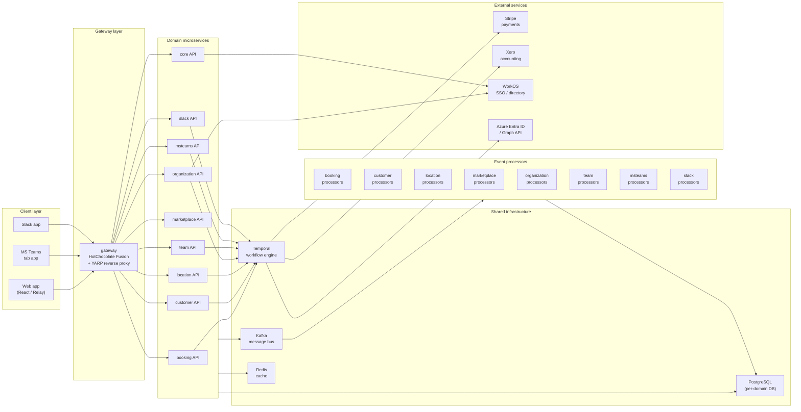
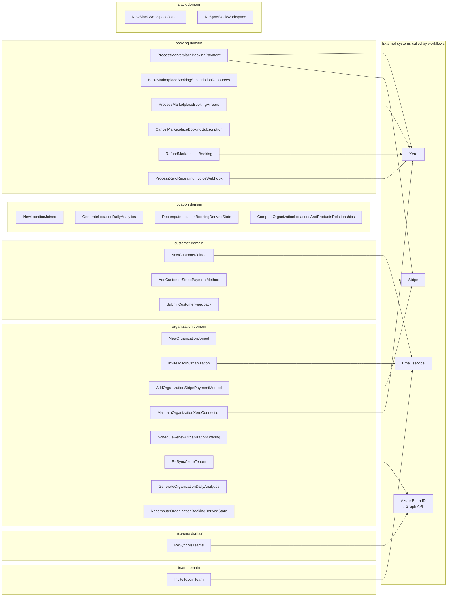
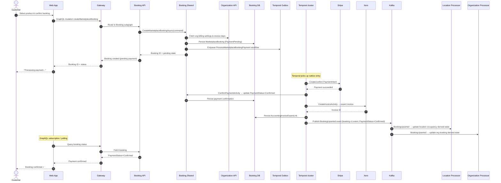

# Skedular Platform — Scheduler Overview

This document gives a cross-domain view of the entire Skedular platform: how the ten
microservice domains relate to each other, how Kafka events flow between them, how
Temporal workflows orchestrate long-running operations, and how a customer booking
request travels end-to-end from the browser to Stripe/Xero and back.

Read it alongside the per-domain architecture documents under each domain's `docs/`
folder and the existing C4 diagrams under `docs/architecture/`.

---

## 1. System Context

All external actors, domains, shared infrastructure, and external systems in one view.

---

## 2. Domain Interaction Map — Kafka Event Flow

Each domain publishes events on its topic(s); other domains' processor services subscribe
to the topics they care about.  Arrows point from **publisher → subscriber**.

```mermaid
flowchart TB
    subgraph Publishers["Event publishers (domains)"]
        BK["booking\n(Booking / BookingInternal)"]
        CU["customer\n(Customer)"]
        LO["location\n(Location)"]
        MK["marketplace\n(Marketplace)"]
        OR["organization\n(Organization / OrganizationInternal\n/ OrganizationMember)"]
        TM["team\n(Team)"]
    end

    subgraph Subscribers["Event subscribers (processors)"]
        BKP["booking\nprocessors"]
        CUP["customer\nprocessors"]
        LOP["location\nprocessors"]
        MKP["marketplace\nprocessors"]
        ORP["organization\nprocessors"]
        TMP["team\nprocessors"]
        MSP["msteams\nprocessors"]
        SLP["slack\nprocessors"]
    end

    BK -->|"BookingInternal"| BKP
    BK -->|"Booking"| LOP

    CU -->|"Customer"| BKP
    CU -->|"Customer"| CUP
    CU -->|"Customer"| LOP
    CU -->|"Customer"| MKP
    CU -->|"Customer"| ORP
    CU -->|"Customer"| TMP
    CU -->|"Customer"| MSP
    CU -->|"Customer"| SLP

    LO -->|"Location"| BKP
    LO -->|"Location"| CUP
    LO -->|"Location"| LOP
    LO -->|"Location"| TMP
    LO -->|"Location"| MSP
    LO -->|"Location"| SLP

    MK -->|"Marketplace"| BKP
    MK -->|"Marketplace"| LOP
    MK -->|"Marketplace"| MKP

    OR -->|"Organization"| BKP
    OR -->|"Organization"| CUP
    OR -->|"Organization"| LOP
    OR -->|"Organization"| MKP
    OR -->|"Organization"| ORP
    OR -->|"Organization"| TMP
    OR -->|"Organization"| MSP
    OR -->|"Organization"| SLP
    OR -->|"OrganizationInternal"| ORP

    TM -->|"Team"| BKP
    TM -->|"Team"| TMP
    TM -->|"Team"| MSP
    TM -->|"Team"| SLP
```

### Topic subscription summary

| Processor domain | Subscribed topics |
|---|---|
| booking | BookingInternal, Location, Organization, Customer, Marketplace, Team |
| customer | Location, Organization |
| location | Booking, Customer, Marketplace, Organization |
| marketplace | Customer, Organization |
| organization | Booking, Customer, OrganizationInternal |
| team | Customer, Location, Organization |
| msteams | Customer, Location, Organization, Team |
| slack | Customer, Location, Organization, Team |

---

## 3. Temporal Workflow Map

All Temporal workflows grouped by owning domain.

---

## 4. GraphQL Federation Diagram

The gateway fuses subgraph schemas from all domain APIs using HotChocolate Fusion.

```mermaid
flowchart TB
    subgraph GW["gateway — HotChocolate Fusion + YARP"]
        Schema["Composed\nfederated schema"]
        Router["YARP reverse\nproxy routes"]
    end

    subgraph Subgraphs["Domain GraphQL subgraphs"]
        S1["booking subgraph\n/v1/graphql"]
        S2["core subgraph\n/v1/graphql"]
        S3["customer subgraph\n/v1/graphql"]
        S4["location subgraph\n/v1/graphql"]
        S5["marketplace subgraph\n/v1/graphql"]
        S6["organization subgraph\n/v1/graphql"]
        S7["team subgraph\n/v1/graphql"]
        S8["msteams subgraph\n/v1/graphql"]
        S9["slack subgraph\n/v1/graphql"]
    end

    Client["Web / mobile\nclient"] -->|"GraphQL over HTTP"| Schema
    Schema -->|"Fusion plan execution"| S1
    Schema -->|"Fusion plan execution"| S2
    Schema -->|"Fusion plan execution"| S3
    Schema -->|"Fusion plan execution"| S4
    Schema -->|"Fusion plan execution"| S5
    Schema -->|"Fusion plan execution"| S6
    Schema -->|"Fusion plan execution"| S7
    Schema -->|"Fusion plan execution"| S8
    Schema -->|"Fusion plan execution"| S9

    Router -->|"REST / gRPC passthrough"| S1
    Router -->|"REST / gRPC passthrough"| S2
    Router -->|"REST / gRPC passthrough"| S3
    Router -->|"REST / gRPC passthrough"| S4
    Router -->|"REST / gRPC passthrough"| S5
    Router -->|"REST / gRPC passthrough"| S6
    Router -->|"REST / gRPC passthrough"| S7
    Router -->|"REST / gRPC passthrough"| S8
    Router -->|"REST / gRPC passthrough"| S9
```

---

## 5. Request Lifecycle — Booking a Marketplace Resource

End-to-end sequence for a customer booking a marketplace product (card payment path).

---

## 6. Reading Guide

| Document | Location | What it covers |
|---|---|---|
| Scheduler overview (this file) | `docs/architecture/scheduler-overview.md` | Cross-domain Kafka flows, Temporal workflows, request lifecycle |
| Booking domain architecture | `booking/docs/architecture/booking-domain-architecture.md` | Payment, Xero invoicing, refunds, subscriptions |
| Booking runtime flows | `booking/docs/architecture/booking-runtime-flows.md` | Temporal workflow state machines |
| System context (C4 L1) | `docs/architecture/level-1-system-context/` | Actor ↔ platform context |
| Container diagram (C4 L2) | `docs/architecture/level-2-container-diagram/` | Domain containers |
| Domain component diagrams (C4 L3) | `docs/architecture/level-3-component-diagram-*/` | Per-domain component breakdowns |
| Shared libraries architecture | `shared/docs/architecture/shared-libraries-architecture.md` | All shared libraries and their relationships |
| Xero bank transfer integration | `docs/architecture/xero-bank-transfer-integration.md` | Xero bank transfer specifics |
| Event catalog | `docs/event-catalog/` | Per-topic event schemas |
| ADR index | `docs/adr-index.md` | Architecture decision records |
