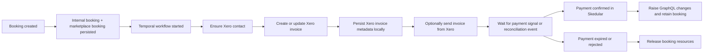
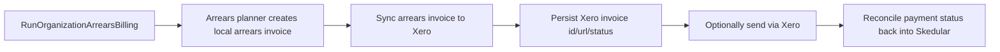

# Xero Bank Transfer Integration Draft

## Scope

This draft defines the first Xero integration for Skedular.

In scope:

- Organization-level Xero connection
- Bank transfer invoice sync to Xero
- Organization arrears invoice sync to Xero
- Payment reconciliation from Xero back into Skedular
- Keeping Stripe as the card-payment path
- Keeping Xero integration state out of core booking tables

Out of scope for the first release:

- Replacing Stripe card checkout
- Moving real-time card authorization or resource locking into Xero
- Full accounting export for every internal financial object

## Design Rules

- Card payments remain Stripe-owned.
- Xero is connected at the organization level.
- Skedular remains the operational source of truth for booking and subscription state.
- Xero becomes the external source of truth for bank-transfer invoice lifecycle once enabled.
- Xero sync must be asynchronous and idempotent.
- Booking/resource lock logic must not depend on synchronous Xero calls.
- Xero-specific fields must not be added to core booking or arrears invoice tables.
- Integration state should live in separate side tables, similar to the current Stripe pattern.

## Current System Shape

The current booking system already separates invoice generation from payment orchestration:

- Marketplace booking creation starts different Temporal workflows based on billing mode and payment method in [MarketplaceBookingService.cs](/Users/morteza/projects/github.com/skedular/skedular/booking/shared/Booking.Shared/Services/MarketplaceBookingService.cs).
- Internal invoice PDF generation and email sending lives in [InvoiceIntegrations.cs](/Users/morteza/projects/github.com/skedular/skedular/booking/shared/Booking.Shared/Activities/InvoiceIntegrations.cs).
- Recurring payment workflows wait for payment status signals in:
  - [PayRecurringBookingViaBankTransfer.cs](/Users/morteza/projects/github.com/skedular/skedular/booking/shared/Booking.Shared/Workflows/PayRecurringBookingViaBankTransfer.cs)
  - [PayRecurringBookingViaCard.cs](/Users/morteza/projects/github.com/skedular/skedular/booking/shared/Booking.Shared/Workflows/PayRecurringBookingViaCard.cs)
- Manual or external payment confirmation already maps to internal signals in [RecurringBookingPaymentService.cs](/Users/morteza/projects/github.com/skedular/skedular/booking/apis/Booking.Api/Services/RecurringBookingPaymentService.cs).
- Organization arrears invoices already exist as a distinct concept in [OrganizationArrearsInvoice.cs](/Users/morteza/projects/github.com/skedular/skedular/booking/shared/Booking.Shared/Database/Entities/OrganizationArrearsInvoice.cs).

This is a good fit for Xero because the existing workflows already have the right seams.

## Proposed Final Architecture

### 1. Organization Domain Owns the Xero Connection

Add a new organization-scoped integration record:

- `OrganizationXeroConnection`

Suggested fields:

- `Id`
- `OrganizationId`
- `TenantId`
- `TenantName`
- `AccessTokenEncrypted`
- `RefreshTokenEncrypted`
- `AccessTokenExpiresAt`
- `RefreshTokenExpiresAt`
- `Scopes`
- `IsActive`
- `LastSuccessfulSyncAt`
- `LastError`
- `DefaultSalesAccountCode`
- `DefaultReceivablesAccountCode`
- `DefaultTrackingCategory1`
- `DefaultTrackingCategory2`
- `DefaultBrandingThemeId`
- `DefaultReferencePrefix`

Suggested location:

- `organization/shared/Organization.Shared/Database/Entities/OrganizationXeroConnection.cs`
- `organization/shared/Organization.Shared/Repositories/OrganizationXeroConnectionRepository.cs`
- `organization/apis/Organization.Api/Services/OrganizationXeroConnectionService.cs`
- `organization/apis/Organization.Api/GraphQL/Xero/*`

Why organization domain:

- The customer requirement is organization-scoped
- Xero authorization belongs to the organization owner/admin
- Existing Stripe/SSO/bank-account patterns already live there

### 2. Booking Domain Owns Invoice Sync State Through Side Tables

The booking domain should not store Xero tokens, and it should not gain Xero-specific columns on core business tables.

Do not add fields like:

- `XeroInvoiceId`
- `XeroInvoiceStatus`
- `XeroInvoiceUrl`

to:

- `MarketplaceBooking`
- `RecurringBooking`
- `OrganizationArrearsInvoice`

Instead, add separate integration-owned side tables.

### 3. Proposed Side Tables

#### 3.1 Provider-specific connection table

Keep the organization connection provider-specific:

- `OrganizationXeroConnection`

This table owns:

- tenant id
- token lifecycle
- scope/configuration
- org-level Xero defaults

#### 3.2 Provider-agnostic invoice mapping table

Add:

- `AccountingInvoiceExportLink`

Suggested fields:

- `Id`
- `OrganizationId`
- `Provider`
- `LocalEntityType`
- `LocalEntityId`
- `ExternalInvoiceId`
- `ExternalInvoiceNumber`
- `ExternalInvoiceUrl`
- `ExternalStatus`
- `SentAt`
- `PaidAt`
- `LastSyncedAt`
- `LastError`

Suggested `LocalEntityType` values for the first release:

- `MarketplaceBooking`
- `RecurringBooking`
- `OrganizationArrearsInvoice`

This keeps the core entities clean while still allowing invoice correlation and reconciliation.

#### 3.3 Provider-agnostic contact mapping table

Add:

- `AccountingContactLink`

Suggested fields:

- `Id`
- `OrganizationId`
- `Provider`
- `CustomerId` nullable
- `ExternalContactId`
- `ExternalContactName`
- `LastSyncedAt`
- `LastError`

This allows:

- customer-paid marketplace invoices
- organization-paid invoices
- reuse of the same Xero contact instead of recreating it on every sync

#### 3.4 Provider-agnostic payment event table

Add:

- `AccountingPaymentEvent`

Suggested fields:

- `Id`
- `OrganizationId`
- `Provider`
- `ExternalInvoiceId`
- `ExternalPaymentId`
- `ExternalStatus`
- `OccurredAt`
- `PayloadJson`
- `ProcessedAt`

This gives an auditable reconciliation trail without putting provider-specific event history into core booking records.

## Current Integration Modes

The current implementation keeps the billing-mode surface smaller than the earlier draft.

- `Disabled`
- `Enabled`
- `RepeatingInvoices`

Meaning:

- `Disabled`: no Xero invoice export
- `Enabled`: supported one-off, recurring, and arrears invoice exports use normal Xero sales invoices
- `RepeatingInvoices`: supported recurring booking exports create Xero repeating invoice templates instead of normal
  Xero sales invoices

Current MVP rule:

- `RepeatingInvoices` only changes the recurring marketplace booking invoice path in
  [InvoiceIntegrations.cs](booking/shared/Booking.Shared/Activities/InvoiceIntegrations.cs)
- one-off marketplace booking invoices and scheduled organization arrears invoices still use the existing normal Xero
  invoice export path
- the current MVP creates a Xero repeating invoice template for supported recurring bookings; it does not model a
  separate first normal invoice plus a second stored repeating-schedule object in Skedular
- the organization billing cycle and the recurring product purchase cadence are separate inputs
- for recurring invoice export, booking first calculates the effective invoice cadence:
  - if purchase cadence is shorter than or equal to the organization billing cycle, invoice on the purchase cadence
  - if purchase cadence is longer than the organization billing cycle, split the recurring charge down to the
    organization billing cycle
- this means short cadences such as a daily pass must not be coerced into a monthly repeating invoice template just
  because the organization billing cycle is monthly
- when booking splits a longer recurring cadence down to the organization billing cycle, the recurring invoice amount
  is split to the per-installment amount before export
- this recurring billing schedule decision is provider-agnostic:
  - internal recurring invoice PDFs should use the same effective cadence and per-installment amount
  - standard Xero recurring invoice exports should use the same effective cadence and per-installment amount
  - Xero repeating templates are just one export mechanism that consumes that same booking-owned decision
- invoice due days are a separate organization-level payment-terms setting and should be applied consistently to:
  - invoice PDFs
  - normal Xero invoice exports
  - Xero repeating invoice templates
- invoice due days do not replace organization billing cycle or recurring purchase cadence
  (`Weekly`, `Fortnightly`, or `Monthly`)
- supported effective recurring cadences for Xero repeating templates are `Weekly`, `Fortnightly`, `Monthly`,
  `TwoMonths`, `Quarterly`, `FourMonths`, `FiveMonths`, `SixMonths`, and `Yearly`
- if the effective recurring cadence is `Daily` or otherwise not representable by Xero repeating invoices, booking
  falls back to the existing normal Xero invoice export path instead of failing the workflow
- existing recurring exports are not auto-migrated when the org changes billing cycle or toggles between standard and
  repeating Xero modes
- the transition freeze only applies once a recurring export has already created a live external Xero invoice or
  repeating template; pending local export links with no external Xero id still follow the current configuration
- if an existing recurring booking already has a Xero repeating template and the current org configuration no longer
  matches it, Skedular freezes that existing repeating template locally and marks the export as transition-required
  instead of silently rewriting the live Xero schedule
- if an existing recurring booking is already on standard Xero invoices when the org later enables
  `RepeatingInvoices`, Skedular keeps that recurring export on standard invoices until an explicit migration path is
  introduced
- when a marketplace subscription is cancelled, Skedular must also stop active recurring payment/invoice workflows for
  its recurring booking instances
- when a marketplace subscription is marked `CancelAtPeriodEnd`, Skedular should keep the current cycle active, disable
  renewal immediately, and only transition the subscription to `Cancelled` once the cycle boundary is reached
- that cancellation mode should be chosen explicitly at the API boundary, not inferred only from persisted subscription
  state
- when a cancelled marketplace subscription has a live Xero repeating invoice template, Skedular must cancel that
  repeating template in Xero instead of leaving it active
- when a one-off marketplace booking is cancelled after an invoice export has been created, Skedular should route that
  cancellation through the same accounting-invoice cancellation boundary instead of only stopping the payment workflow
- timeout, expiry, and failed-payment cleanup should also route through that same accounting-invoice cancellation
  boundary for both one-off and recurring booking flows
- if Xero invoice/template cancellation cannot be completed during local cancellation, Skedular should keep the local
  cancellation authoritative and mark the export as `TransitionRequired` for retry/manual follow-up instead of failing
  the whole local cancellation flow
- recurring booking cleanup should also mark the parent recurring marketplace booking payment status as terminal so the
  subscription scheduler does not restart payment workflows or recreate future instances after cancellation/expiry
- internal Skedular-hosted invoices should also persist durable cancelled-accounting state even when Xero is not the
  provider for that invoice
- already-generated or already-sent invoices are still historical records; cancellation stops future billing rather than
  retracting past invoices

## Workflow Design

### A. One-off Marketplace Booking Paid by Bank Transfer

Proposed workflow:

- `PayBookingViaBankTransfer` stays the orchestrator
- replace internal PDF generation with `SyncBankTransferInvoiceToXero`
- reconciliation updates internal payment state

### B. Recurring Marketplace Booking Paid by Bank Transfer

This remains very close to the current workflow:

- `PayRecurringBookingViaBankTransfer` still owns the lifecycle
- instead of generating and emailing an internal invoice PDF first, it syncs the invoice to Xero
- when Xero payment is reconciled, Skedular signals the existing workflow
- if not paid before expiry, existing resource release logic stays in place

This is intentionally conservative because the recurring lifecycle is already working.

### C. Organization Arrears Billing

This is the strongest first Xero use case because it is already invoice-oriented instead of checkout-oriented.

## Services to Introduce

### In Organization Domain

- `IXeroOAuthService`
- `IOrganizationXeroConnectionService`
- `IXeroTokenRefreshService`

Responsibilities:

- generate connect URL
- handle OAuth callback
- encrypt/store tokens
- refresh tokens
- disconnect Xero
- expose org Xero configuration to other domains

### In Booking Domain

- `IXeroInvoiceService`
- `IXeroContactService`
- `IXeroReconciliationService`
- `IXeroOrganizationSettingsClient`

Responsibilities:

- ensure a billing party exists as a Xero contact
- create/update invoices
- send invoices when enabled
- fetch invoice/payment status
- map external updates back into internal payment status
- read org-level Xero settings from organization domain
- persist integration state in side tables rather than core booking tables

## API and UI Changes

### Organization API

Add GraphQL mutations:

- `connectOrganizationXero`
- `disconnectOrganizationXero`
- `refreshOrganizationXeroConnection`
- `updateOrganizationXeroBillingSettings`

Add query:

- `organizationXeroConnection`

Suggested UI placement:

- organization admin setup
- billing/admin section near bank accounts and tax details

### Booking API

Expose read-only sync state on invoice-bearing objects:

- `externalInvoiceProvider`
- `externalInvoiceStatus`
- `externalInvoiceUrl`
- `externalInvoiceNumber`
- `externalInvoiceLastSyncedAt`
- `externalInvoiceLastSyncError`

This gives the user visibility into whether Xero is the authoritative invoice.

## Reconciliation Strategy

Primary path:

- receive Xero webhook for invoice/payment changes

Fallback path:

- periodic polling by `ExternalInvoiceId`

On payment confirmation:

1. locate internal invoice-bearing record by Xero invoice id
2. update internal invoice sync status
3. update internal payment status
4. signal existing workflow

For recurring bank transfer that means:

- signal `PayRecurringBookingViaBankTransfer.SetPaymentStatusAsync`

For one-off bank transfer:

- signal `PayBookingViaBankTransfer.SetPaymentStatusAsync`

## Idempotency Rules

- Use a deterministic local correlation key per invoice:
  - `organization-arrears:{invoiceId}`
  - `marketplace-booking:{bookingId}`
- `recurring-booking:{recurringBookingId}:{billingCycleStart}`
- Never create a new Xero invoice if an `AccountingInvoiceExportLink` already exists for the same local entity and provider
- Webhook processing must be idempotent by external event id plus invoice id
- Token refresh must be serialized per organization connection

## Failure Handling

If Xero is unavailable:

- do not fail the booking transaction itself
- persist local invoice/payment state first
- retry sync via Temporal
- surface sync status in GraphQL/UI

If reconciliation is delayed:

- existing workflow expiry logic remains in control
- paid bookings are not assumed until Skedular receives confirmation

This protects booking/resource integrity.

## Release Plan

### Phase 1

- org-level Xero connection
- org arrears invoice sync
- no marketplace bookings yet

### Phase 2

- one-off marketplace bank transfer invoice sync
- webhook/polling reconciliation

### Phase 3

- recurring marketplace bank transfer sync
- dashboard status and audit trail

### Phase 4

- accounting mirror for Stripe-paid invoices
- no change to Stripe checkout ownership

## First Implementation Slice

The first code slice should be:

1. add `OrganizationXeroConnection`
2. add `AccountingInvoiceExportLink`
3. add `AccountingContactLink`
4. add org GraphQL/API to connect and view status
5. add `IXeroInvoiceService` as an abstraction only
6. wire organization arrears billing to call that abstraction
7. keep current PDF/email path behind a feature flag fallback

That gives a safe draft implementation without destabilizing marketplace checkout and without polluting core invoice tables.

## Questions to Resolve in the Next Iteration

- Default behavior: Xero should send and host the invoice unless commercial or feature constraints force Skedular to keep sending it.
- Should Xero contact mapping be customer-only, or also support organization billing contacts explicitly?
- Do we want `AccountingInvoiceExportLink` to support all planned local entity types from day one, or start with `OrganizationArrearsInvoice` only and extend it in Phase 2?
- Do we want webhook-first reconciliation immediately, or polling-first with webhooks added after?

## Recommended Next Step

Implement Phase 1 only:

- organization-level Xero connection
- side-table invoice/contact mappings
- organization arrears invoice sync
- explicit feature flag on the organization

That is the smallest slice with the highest business value and the least risk to booking operations.
