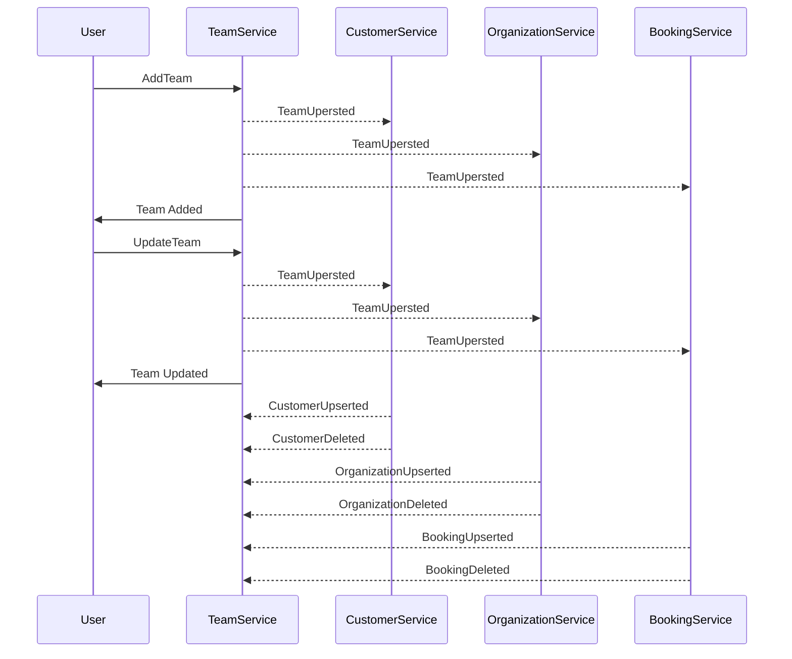

## Overview

The Team Domain encompasses all services and components related to handling teams within the organization.

## Bounded context

<NodeGraph />

### Team example (sequence diagram)

## Flows

### Add Team flow
<Flow id="AddTeamFlow" version="latest" includeKey={false} />

### Update Team flow
<Flow id="UpdatedTeamFlow" version="latest" includeKey={false} />

### Delete Team flow
<Flow id="DeleteTeamFlow" version="latest" includeKey={false} />