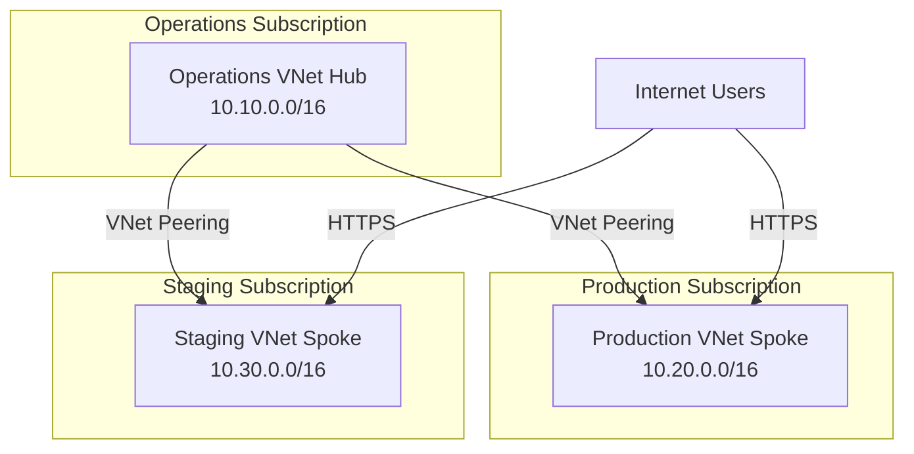

# Azure Networking Architecture Design

## 1. Overview

This document describes the network architecture for Azure deployment using a hub-and-spoke topology. The design supports multi-environment separation, Kubernetes workloads, and a three-layer web service architecture (frontend, backend, data).

## 2. Design Principles

- **Separation of environments** for billing and RBAC using Azure subscriptions and resource groups.
- **Hub-and-spoke topology** for centralized management and shared services.
- **High availability** via subnet distribution across Azure Availability Zones (AZs).

## 3. Environment Topology

| Environment      | VNet CIDR        | Notes                                       |
|------------------|------------------|----------------------------------------------|
| azr-au-ops-01    | 10.10.0.0/16     | Operation environment - Centralized management, logging, monitoring |
| azr-au-prd-01    | 10.20.0.0/16     | Production environment Australia East region - Primary user-facing workloads |
| azr-au-stg-01    | 10.30.0.0/16     | Staging environment Australia East region - Pre-prod environment for release validation |

We will start building production and staging environments, and decide on the rest of the environments later.

## 4. Subnetting

Subnets are defined per environment and are not bound to specific Availability Zones. The following layout is based on the current locals.tf configuration:

### Example: Production Environment (`azr-au-prd-01`, 10.20.0.0/16)

| Subnet Name        | CIDR Block         | Description                                 |
|--------------------|-------------------|---------------------------------------------|
| ingress-subnet     | 10.20.0.0/24      | Public IP and Load Balancer                 |
| aks-public-subnet  | 10.20.4.0/22      | AKS public (customer-facing) workloads      |
| aks-private-subnet | 10.20.8.0/22      | AKS private (backend) workloads             |
| aks-system-subnet  | 10.20.12.0/22     | K8s system components                       |
| database-subnet    | 10.20.16.0/24     | PostgreSQL                                  |
| eventing-subnet    | 10.20.17.0/24     | Kafka brokers                               |
| cache-subnet       | 10.20.18.0/24     | Redis nodes                                 |
| bastion-subnet     | 10.20.70.0/27     | Bastion or jumpbox access                   |

### Example: Staging Environment (`azr-au-stg-01`, 10.30.0.0/16)

| Subnet Name        | CIDR Block         | Description                                 |
|--------------------|-------------------|---------------------------------------------|
| ingress-subnet     | 10.30.0.0/24      | Public IP and Load Balancer                 |
| aks-public-subnet  | 10.30.4.0/22      | AKS public (customer-facing) workloads      |
| aks-private-subnet | 10.30.8.0/22      | AKS private (backend) workloads             |
| aks-system-subnet  | 10.30.12.0/22     | K8s system components                       |
| database-subnet    | 10.30.16.0/24     | PostgreSQL                                  |
| eventing-subnet    | 10.30.17.0/24     | Kafka brokers                               |
| cache-subnet       | 10.30.18.0/24     | Redis nodes                                 |
| bastion-subnet     | 10.30.70.0/27     | Bastion or jumpbox access                   |

## 5. VNet Interconnection (Hub-and-Spoke)

The following diagram shows the interconnection between VNets and subscriptions for operations (hub), production, and staging (spokes). Each environment is in its own subscription and VNet. Peering is used for connectivity.

## 6. Notes

- Subnets are not bound to specific Availability Zones; resources within subnets can be deployed to any AZ.
- Subnet blocks are contiguous for better routing table optimization and easier expansion.
- Each application layer (ingress, AKS, data) is split into logical subnets for security and management.
- Kafka, PostgreSQL, and Redis are segregated for access control via NSGs or firewalls.
- Hub/Operations VNet (10.10.0.0/16) is reserved for shared tools, VPN, monitoring, CI/CD, and does not require subnet segregation unless needed in the
