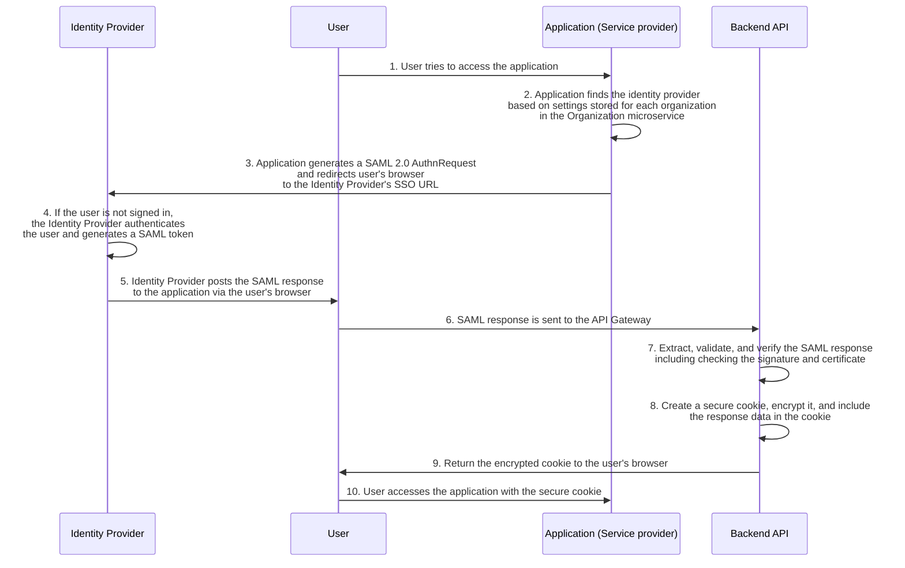
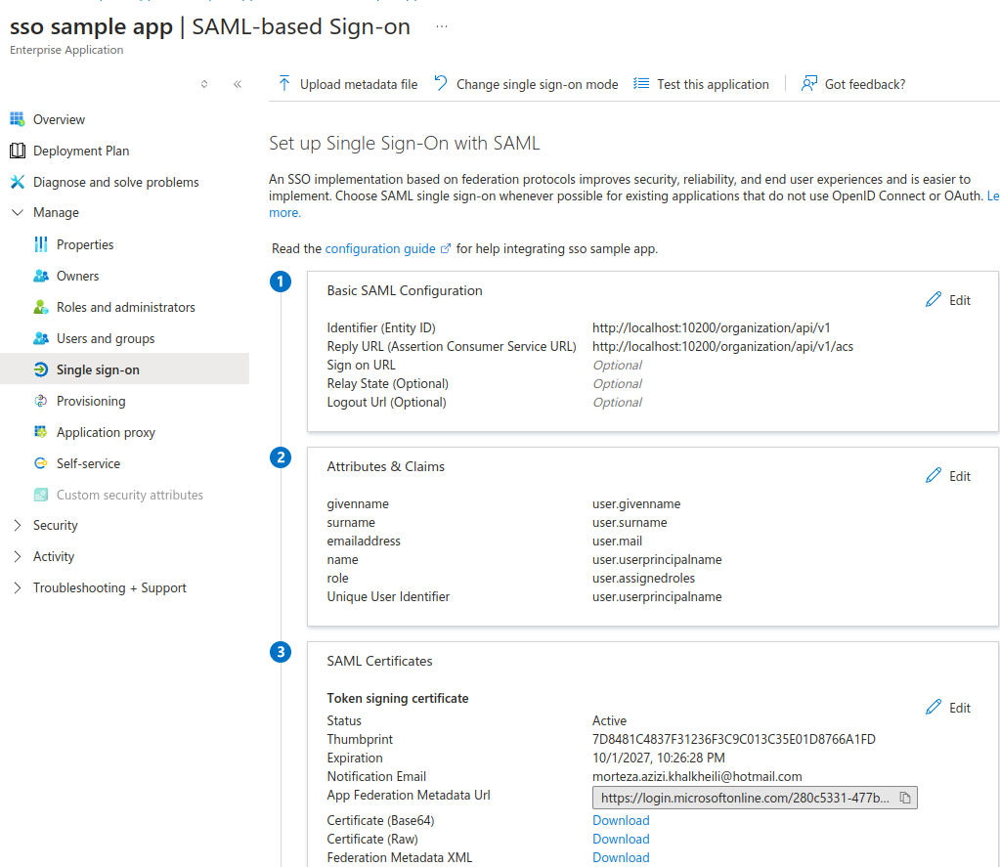
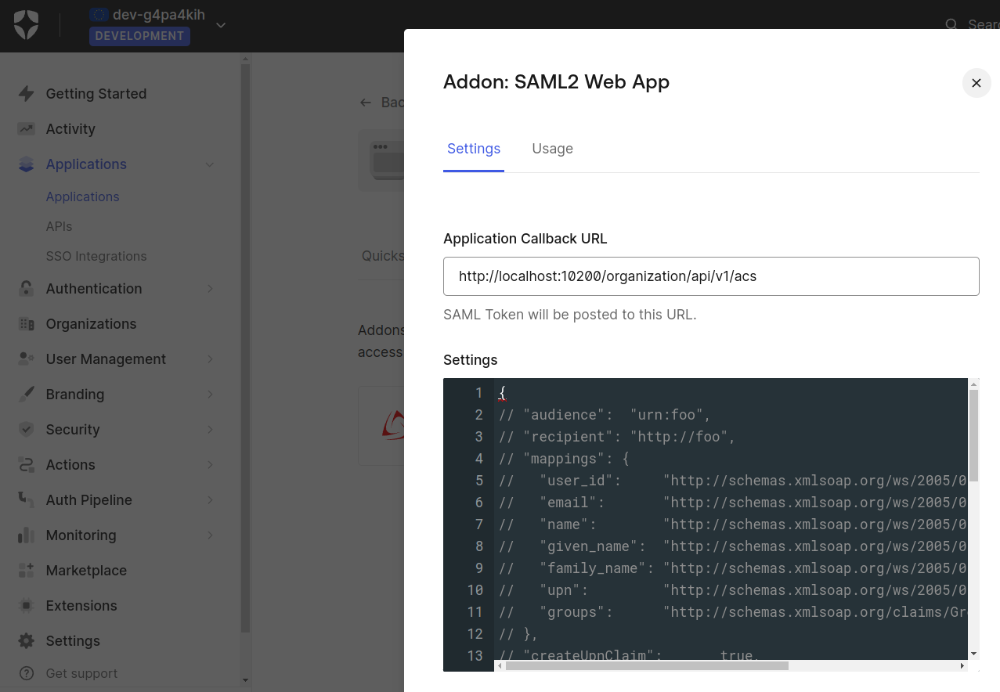

# Single Sign-On (SSO) Integration

## Purpose
Single Sign-On (SSO) simplifies user authentication by enabling secure and seamless access to multiple applications using a single set of credentials. It reduces password fatigue, improves user experience, and strengthens security by relying on centralized identity providers for authentication. This document covers integration with SSO providers like Azure AD and Auth0.

---

## Single sign-on SAML protocol

## SSO with Azure AD
- **Purpose:** Leverage Microsoft’s enterprise-grade identity platform to enable secure authentication for users within organizations using Azure Active Directory.

- **Configuration Steps:**
    1. Register the application in Azure Active Directory.
    2. Enable and configure SSO on app registration. 
    3. Implement the ACS (Assertion Consumer Service) endpoint in the API to process SAML assertions and set the ACS
    4. IN the Azure Entity ID needs to be set, for simplicity you can set it to application endpoint 
    5. Test and validate the SSO flow using Azure AD.

Note : User should be able to set up some settings in organization such as :
- Entity Id, Login Url ,Metadata Url and redirect Url
- In User tab , you should add some users with roles

---

## SSO with Auth0
- **Purpose:** Utilize Auth0's flexible authentication solutions to provide SSO for diverse user bases, including customers, partners, and employees, using either SAML or OpenID Connect protocols.

- **Configuration Steps:**
    1. Create an application in the Auth0 dashboard.
    2. Set the application typ to 'Regular Web Application'
    3. in general setting tab, set Allowed Callback Urls to your ACS endpoint, for example "http://localhost:10200/organization/api/v1/acs"
    4. In Addons tab, Enable the SSO and make sure the call back is set correctly 
    5. In general settings tab, in advanced setting you can find metadata url

---

