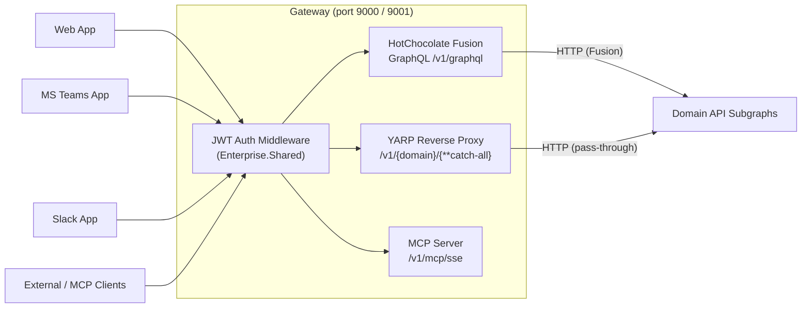
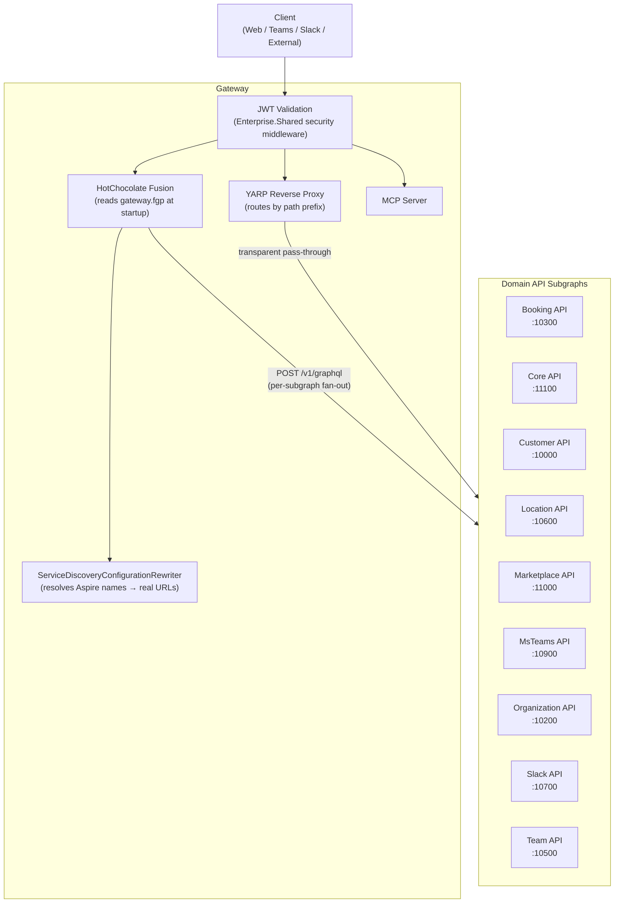
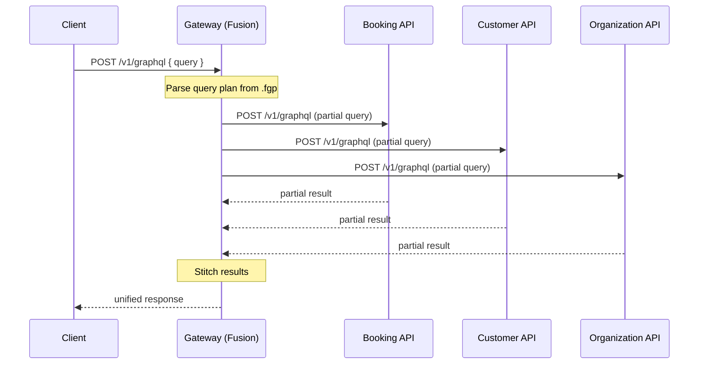
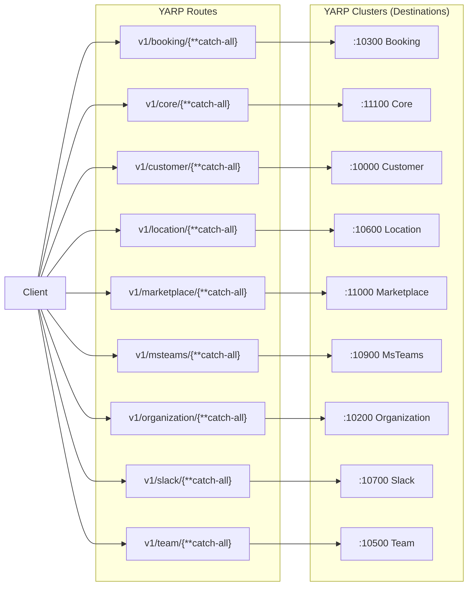
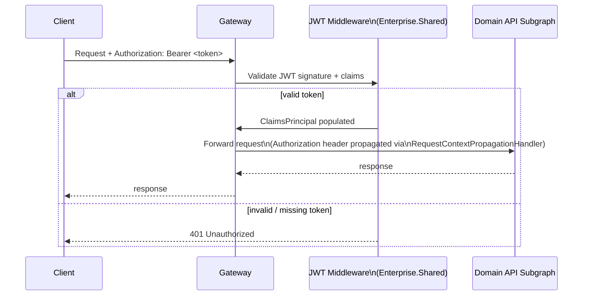
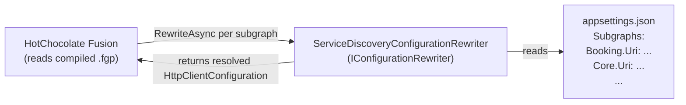
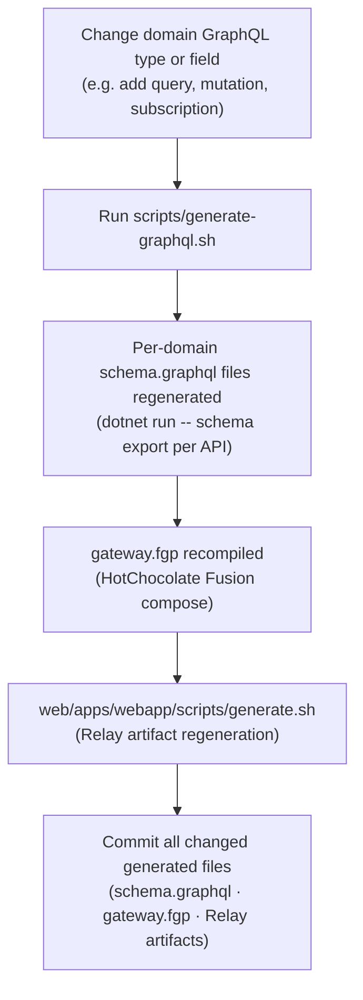

# Gateway Architecture

This document is a high-level architecture view of the Gateway as it exists today.

It is intentionally C4-style rather than implementation-complete. The goal is to explain:

- how the gateway acts as the single entry point for all clients
- how GraphQL federation is composed using HotChocolate Fusion
- how REST traffic is routed via YARP reverse proxy
- how authentication is handled and propagated to subgraphs
- how Aspire service-discovery names are rewritten to real URLs at runtime
- how schema changes flow from domain APIs through to the composed gateway schema

## Scope

This document covers the Gateway surfaces under:

- `gateway/apis/Gateway`

It references all domain API subgraphs that the gateway composes:

- Booking, Core, Customer, Location, Marketplace, MsTeams, Organization, Slack, Team

## Purpose and Scope

The Gateway is the **single entry point** for all Skedular clients (web app, Teams app, Slack app, and external
integrations). It contains **no domain business logic** — it is a pure routing and composition layer.

Two traffic paths flow through the gateway:

1. **GraphQL** — HotChocolate Fusion composes all domain GraphQL subgraphs into one federated schema. Clients send a
   single query to the gateway and Fusion fans out to the relevant subgraphs, stitches results, and returns a unified
   response.

2. **REST** — YARP reverse proxy routes requests by URL path prefix to the matching domain API. The gateway adds no
   transformation; it is transparent pass-through with auth context forwarded.

## System Context

## Architecture Diagram

## GraphQL Fusion Composition

```mermaid
flowchart LR
    subgraph SchemaGeneration["Schema Generation  (offline / CI)"]
        direction TB
        ProtoGen["api-definitions/generate.sh\n(OpenAPI + protobuf)"]
        GqlScript["scripts/generate-graphql.sh\n(per-domain schema export\n+ fusion compose)"]
        FgpFile["gateway/apis/Gateway/gateway.fgp\n(compiled fusion package)"]

        ProtoGen --> GqlScript
        GqlScript --> FgpFile
    end

    subgraph GatewayRuntime["Gateway Runtime"]
        direction TB
        EmbeddedFgp["gateway.fgp embedded\nin Gateway assembly"]
        FusionServer["AddFusionGatewayServer()\n.ConfigureFromFile(fgp)"]
        SDRw["ServiceDiscoveryConfigurationRewriter\nrewrites subgraph endpoint URIs\nfrom appsettings Subgraphs config"]

        EmbeddedFgp --> FusionServer
        FusionServer --> SDRw
    end

    subgraph Subgraphs["Subgraph APIs (each exports schema.graphql)"]
        B["Booking"]
        Co["Core"]
        Cu["Customer"]
        L["Location"]
        M["Marketplace"]
        MT["MsTeams"]
        O["Organization"]
        S["Slack"]
        T["Team"]
    end

    Subgraphs -->|"dotnet run -- schema export\n(via generate-graphql.sh)"| GqlScript
    FgpFile -->|"bundled into assembly"| EmbeddedFgp
    SDRw -->|"HTTP requests"| Subgraphs
```

### How a GraphQL Request is Processed

## YARP Routing

The gateway configures YARP from `appsettings.json` under the `ReverseProxy` key. Each domain has a route (path
prefix) and a cluster (destination address).

YARP routing is transparent — the gateway forwards the full path and headers, including the JWT bearer token. No
response transformation is applied.

## Auth Flow

JWT validation is handled by Enterprise.Shared security middleware registered in `AddDefaultServices<Program>()`.
The gateway does not issue tokens — it only validates them and forwards auth context to subgraphs.

Auth context is propagated to subgraphs by `RequestContextPropagationHandler`, which is registered as an HTTP message
handler on the `Fusion` HTTP client. Subgraphs receive the original `Authorization` header and resolve the caller
identity independently using the same JWT validation middleware.

## ServiceDiscovery — Aspire Name Resolution

In local development (Aspire-hosted), subgraph URLs are configured by service-discovery names. At runtime,
`ServiceDiscoveryConfigurationRewriter` intercepts each subgraph's `HttpClientConfiguration` and replaces the
endpoint URI with the resolved address from `appsettings.json` under `Subgraphs`:

This decouples the compiled `.fgp` schema package (which may embed compile-time URIs) from the actual runtime
endpoints, enabling both local Aspire dev and production deployments to share the same compiled artifact.

## Schema Regeneration Workflow

Any change to a domain GraphQL schema requires regenerating the composed fusion schema and the embedded `.fgp` file.

> **Do not hand-edit** `gateway.fgp`, per-domain `schema.graphql` files, or
> `api-definitions/graphql/skedular/v1/schema.graphql`. Always use `scripts/generate-graphql.sh`
> (or `make generate` for the full regeneration pipeline).

The full pipeline via `make generate` runs:

1. `api-definitions/generate.sh` — regenerates OpenAPI controller bases, API clients, and protobuf event classes.
2. `scripts/generate-graphql.sh` — exports per-API schemas, composes the gateway fusion package, updates the composed
   schema, and regenerates GraphQL init/schema files.
3. `web/apps/webapp/scripts/generate.sh` — regenerates TypeScript API clients and Relay artifacts.

## Reading Guide

| You want to understand… | Start here |
|---|---|
| Gateway startup and Fusion wiring | `gateway/apis/Gateway/Program.cs` |
| YARP route and cluster configuration | `gateway/apis/Gateway/appsettings.json` → `ReverseProxy` section |
| Subgraph URL configuration | `gateway/apis/Gateway/appsettings.json` → `Subgraphs` section |
| How subgraph URIs are resolved at runtime | `gateway/apis/Gateway/ServiceDiscoveryConfigurationRewriter.cs` |
| Subgraph configuration model | `gateway/apis/Gateway/Configurations/SubgraphsConfigurations.cs` |
| Auth context propagation to subgraphs | `gateway/apis/Gateway/Extensions.cs` → `RequestContextPropagationHandler` |
| GraphQL Fusion schema regeneration | `scripts/generate-graphql.sh` |
| Full regeneration pipeline | `Makefile` → `make generate` |
| Compiled fusion schema package | `gateway/apis/Gateway/gateway.fgp` (binary; regenerate, do not edit) |
