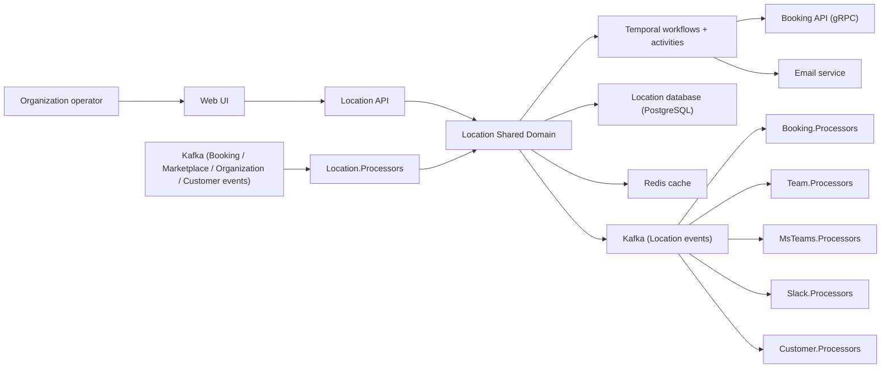
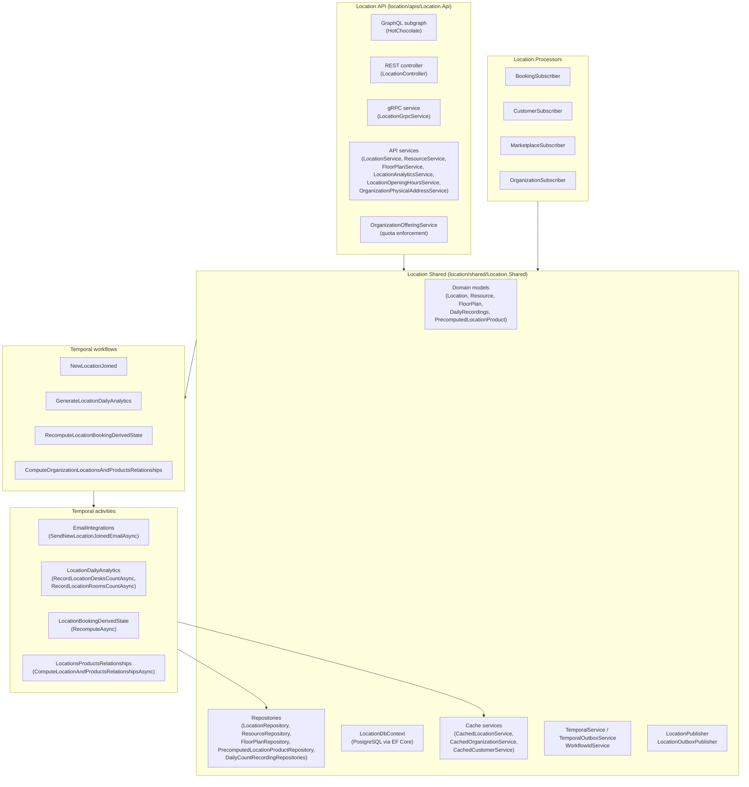
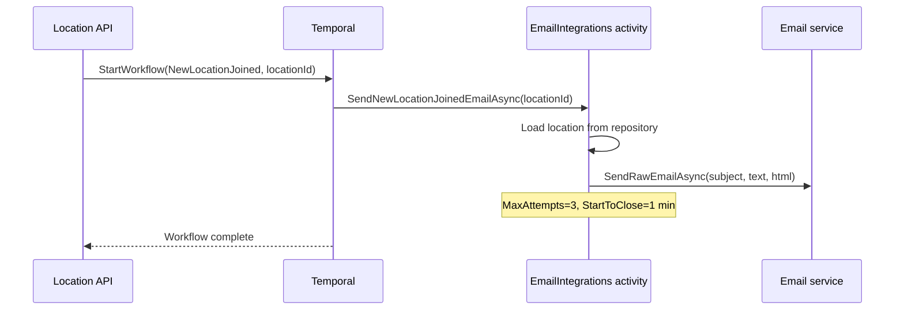
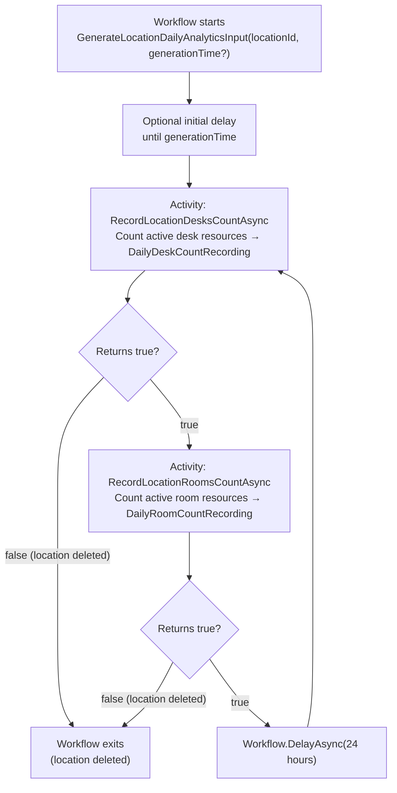
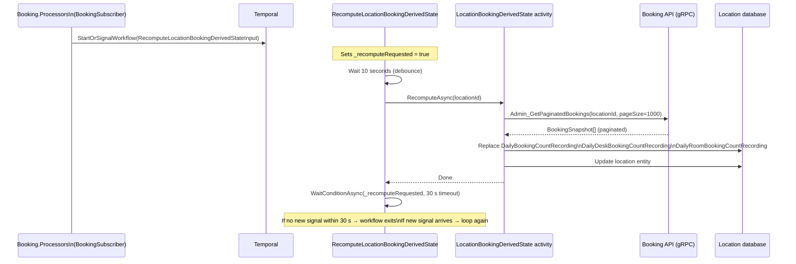
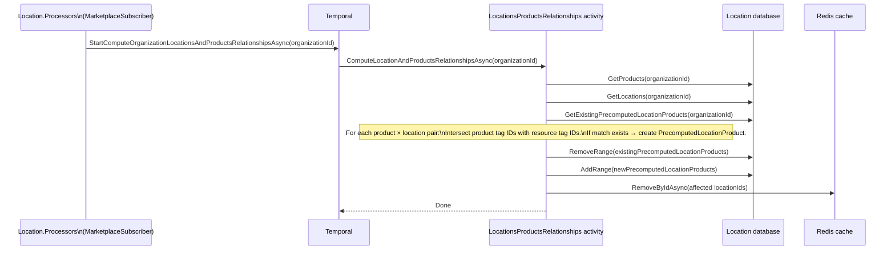
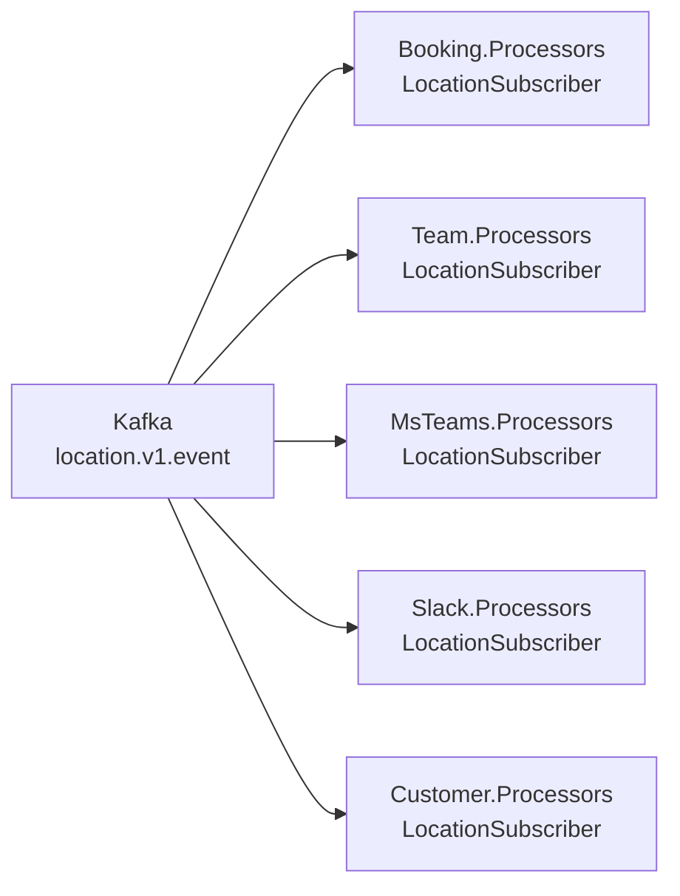
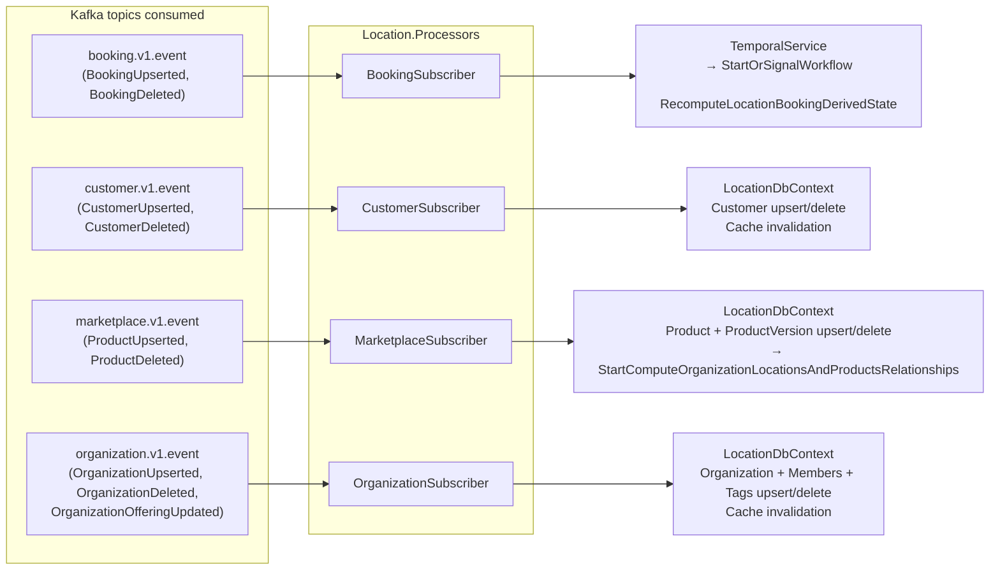
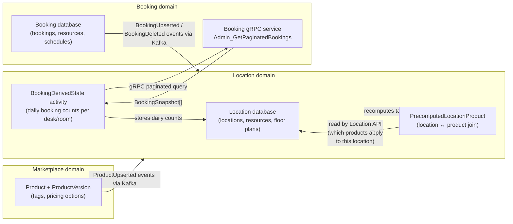

# Location Domain Architecture

This document is a high-level architecture view of the Location domain as it exists today.

It is intentionally C4-style rather than implementation-complete. The goal is to explain:

- how locations, resources, and floor plans are managed
- how Temporal workflows drive analytics generation, booking-derived state recomputation, and location–product
  relationship computation
- how the location domain integrates with the booking, marketplace, and organization domains through Kafka events
- how location data feeds booking resource allocation

## Scope

This document covers the location domain surfaces under:

- `location/apis/Location.Api`
- `location/shared/Location.Shared`
- the location-owned Temporal workflows and activities

It also references the external systems and sibling domains that the location domain coordinates with:

- Booking API (gRPC — for booking snapshot queries)
- Kafka (event publication and consumption)
- Temporal (durable workflow execution)
- PostgreSQL (location database)
- Redis (cache)

---

## Purpose & Scope

The Location domain is the authoritative source of truth for:

- **Physical locations** — workspaces an organization owns or operates.
- **Resources** — individual bookable units (desks, rooms, amenities) inside a location.
- **Floor plans** — spatial layout metadata that maps resources to positions.
- **Location memberships and invitations** — joining a location triggers an email flow.
- **Booking-derived state** — rolling analytics computed from live booking data pulled from the Booking API.
- **Location–product relationships** — precomputed mapping of which marketplace products apply to which locations,
  derived from matching organization tags.

---

## Core Concepts

- `Location`  
  A physical workspace owned by an organization. Contains resources, floor plans, and accumulated analytics.

- `Resource`  
  A bookable unit inside a location (desk or room). Tagged with organization tags that control product eligibility.

- `Floor plan`  
  A spatial layout document that positions resources on a map inside a location.

- `DailyDeskCountRecording` / `DailyRoomCountRecording`  
  Daily capacity snapshot — count of active desks or rooms at the time of recording. Created by the
  `GenerateLocationDailyAnalytics` workflow.

- `DailyBookingCountRecording` / `DailyDeskBookingCountRecording` / `DailyRoomBookingCountRecording`  
  Daily booking totals derived from actual booking data. Created by the `RecomputeLocationBookingDerivedState`
  workflow.

- `PrecomputedLocationProduct`  
  A materialized join row that records which marketplace product applies to which location, based on matching
  organization tags. Created by the `ComputeOrganizationLocationsAndProductsRelationships` workflow.

- `Offering`  
  An organization-level subscription tier from `Api.Shared.Services.Offering` that controls the maximum number of
  locations and members allowed.

---

## System Context



---

## Container View



---

## Directory Layout

```
location/
├── apis/
│   └── Location.Api/
│       ├── Controllers/LocationController.cs       # REST endpoints
│       ├── GraphQL/                                # HotChocolate subgraph
│       │   ├── Location/                           # Location queries/mutations
│       │   ├── Resource/                           # Resource queries/mutations
│       │   ├── FloorPlan/                          # Floor plan queries/mutations
│       │   ├── Analytics/                          # Analytics queries
│       │   ├── ContactedVia/                       # Contacted-via mutations
│       │   ├── PhysicalAddress/                    # Physical address mutations
│       │   └── Ownership/                          # Ownership mutations
│       ├── Grpc/LocationGrpcService.cs             # gRPC service
│       ├── Mappers/Mapper.cs
│       └── Services/
│           ├── Authorization/
│           │   ├── OrganizationAuthorizationService.cs
│           │   ├── OrganizationOfferingService.cs  # Quota enforcement
│           │   └── OrganizationSsoAuthorizationService.cs
│           ├── LocationService.cs
│           ├── ResourceService.cs
│           ├── FloorPlanService.cs
│           ├── LocationAnalyticsService.cs
│           └── LocationOpeningHoursService.cs
├── shared/
│   ├── Location.Shared/
│   │   ├── Activities/
│   │   │   ├── EmailIntegrations.cs
│   │   │   ├── LocationBookingDerivedState.cs
│   │   │   ├── LocationDailyAnalytics.cs
│   │   │   └── LocationsProductsRelationships.cs
│   │   ├── Database/
│   │   │   ├── Entities/                           # EF Core entities
│   │   │   ├── Migrations/
│   │   │   └── LocationDbContext.cs
│   │   ├── EmailTemplates/
│   │   │   └── NewLocationJoined.template.html/.txt
│   │   ├── Models/                                 # Domain models
│   │   ├── Publishers/
│   │   │   ├── LocationPublisher.cs
│   │   │   └── LocationOutboxPublisher.cs
│   │   ├── Repositories/
│   │   ├── Services/
│   │   │   ├── Cache/
│   │   │   │   ├── CachedLocationService.cs
│   │   │   │   ├── CachedOrganizationService.cs
│   │   │   │   └── CachedCustomerService.cs
│   │   │   ├── TemporalOutboxService.cs
│   │   │   ├── TemporalService.cs
│   │   │   └── WorkflowIdService.cs
│   │   └── Workflows/
│   │       ├── NewLocationJoined.cs
│   │       ├── GenerateLocationDailyAnalytics.cs
│   │       ├── RecomputeLocationBookingDerivedState.cs
│   │       ├── ComputeOrganizationLocationsAndProductsRelationships.cs
│   │       └── Constants.cs
│   └── Location.Infrastructure/
│       └── Services/MigrationService.cs
├── domain/
│   ├── Location.Domain.AppHost/AppHost.cs          # Aspire app host
│   ├── Location.Domain.FakeDependencies/
│   └── Location.Domain.IntegrationTests/
├── jobs/
│   └── Location.Jobs/                              # Scheduled jobs
└── processors/
    └── Location.Processors/
        └── Subscribers/
            ├── BookingSubscriber.cs
            ├── CustomerSubscriber.cs
            ├── MarketplaceSubscriber.cs
            └── OrganizationSubscriber.cs
```

---

## Temporal Workflow Details

### Workflow ID ownership

All workflow IDs are constructed by `WorkflowIdService` in `Location.Shared.Services`. This centralises prefix
definitions and ensures that production code and tests share the same ID-generation contract.

```
GenerateLocationDailyAnalytics-{locationId}
RecomputeLocationBookingDerivedState-{locationId}
ComputeLocationProductRelationships-{organizationId}
NewLocationJoined-{locationId}
```

---

### `NewLocationJoined`

Fires when a new location is created. Sends a welcome/notification email via the `EmailIntegrations` activity.



**Key behaviour:**
- Guards on `EmailConfiguration.EnableNewLocationJoinedEmail` — email can be disabled in configuration.
- Renders `NewLocationJoined.template.html` and `.txt` with `{{LOCATION_ID}}` and `{{LOCATION_NAME}}` substitution.
- Retries up to 3 times with a 1-minute maximum interval.

---

### `GenerateLocationDailyAnalytics`

A long-running, perpetual workflow that wakes daily to snapshot the current desk and room counts for a location.



**Key behaviour:**
- Self-perpetuating: after each 24-hour delay it re-runs the recording activities in a `do/while(true)` loop.
- Activities return `false` when the location no longer exists, causing the workflow to exit cleanly.
- Each activity has `StartToCloseTimeout = 1 min` and retries up to 3 times.

---

### `RecomputeLocationBookingDerivedState`

A long-lived, signal-driven workflow that maintains up-to-date booking analytics for a location. The
`BookingSubscriber` processor signals it whenever a booking involving this location is created, updated, or deleted.



**Key behaviour:**
- Uses a `_recomputeRequested` flag and a `BookingChanged` signal to coalesce rapid successive booking changes into a
  single recompute.
- 10-second debounce delay prevents thundering-herd recompute on bulk booking operations.
- 30-second idle timeout causes the workflow to self-terminate when no further signals arrive, keeping Temporal state
  clean.
- Activity queries the Booking API over gRPC in pages of 1,000 bookings.
- `StartToCloseTimeout = 10 min` to allow large locations with many bookings to complete.

---

### `ComputeOrganizationLocationsAndProductsRelationships`

Triggered whenever a marketplace product is upserted (via `MarketplaceSubscriber`). Recomputes which locations in
an organization are eligible for each product, based on matching organization tags across location resources.



**Key behaviour:**
- Uses the first `ProductVersion`'s organization tags of type `Product` as the filter set.
- A location matches if any of its resources carries at least one matching product tag.
- Replaces all existing `PrecomputedLocationProduct` rows for the organization atomically.
- Invalidates the Redis cache for all affected locations so subsequent reads pick up fresh relationship data.
- `StartToCloseTimeout = 1 min`, retries up to 3 times with a 30-second maximum interval.

---

## Event Publication

The location domain publishes two Kafka event types via `LocationPublisher` (direct) and `LocationOutboxPublisher`
(transactional outbox):

| Event type        | Condition                        | Key field    |
|-------------------|----------------------------------|--------------|
| `LocationUpserted` | Location created or updated     | `locationId` |
| `LocationDeleted`  | Location soft-deleted           | `locationId` |

Both publishers emit to the `location.v1.event` Kafka topic.  
`LocationOutboxPublisher` writes event rows inside the same database transaction as the domain mutation, guaranteeing
at-least-once delivery.

### Consumers of location events



---

## Processor Subscriptions

`Location.Processors` consumes events from four Kafka topics:



### Subscriber responsibilities

| Subscriber | Events handled | Effect |
|---|---|---|
| `BookingSubscriber` | `BookingUpserted`, `BookingDeleted` | Signals `RecomputeLocationBookingDerivedState` for each involved location |
| `CustomerSubscriber` | `CustomerUpserted`, `CustomerDeleted` | Upserts/removes customer + identities in local DB; invalidates customer cache |
| `MarketplaceSubscriber` | `ProductUpserted`, `ProductDeleted` | Upserts/removes product + product versions in local DB; triggers `ComputeOrganizationLocationsAndProductsRelationships` |
| `OrganizationSubscriber` | `OrganizationUpserted`, `OrganizationDeleted`, `OrganizationOfferingUpdated` | Upserts/removes organization, members, tags, SSO settings in local DB; invalidates organization cache |

---

## Relationship to the Booking Domain

The location domain and the booking domain share a bidirectional data dependency:



**Data flow summary:**

1. Booking domain publishes `BookingUpserted`/`BookingDeleted` events.
2. `Location.Processors.BookingSubscriber` receives these events and signals
   `RecomputeLocationBookingDerivedState` for each affected location.
3. The workflow's `LocationBookingDerivedState` activity calls the Booking gRPC API to retrieve a full
   paginated snapshot of all bookings for the location.
4. It then recomputes and replaces the daily booking count rows (`DailyBookingCountRecording`,
   `DailyDeskBookingCountRecording`, `DailyRoomBookingCountRecording`) in the Location database.
5. Booking resources are tagged with organization tags that also appear on marketplace products; the
   `ComputeOrganizationLocationsAndProductsRelationships` workflow builds the `PrecomputedLocationProduct` table from
   this intersection so the Location API can surface which products are available at each location without a live join.

---

## Reading Guide

| You want to understand… | Start here |
|---|---|
| How a location is created and what triggers the welcome email | `Location.Api/Services/LocationService.cs` → `NewLocationJoined` workflow |
| How daily desk/room capacity snapshots are generated | `GenerateLocationDailyAnalytics` workflow + `LocationDailyAnalytics` activity |
| How booking analytics are maintained per location | `RecomputeLocationBookingDerivedState` workflow + `LocationBookingDerivedState` activity |
| How marketplace products map to locations | `ComputeOrganizationLocationsAndProductsRelationships` workflow + `LocationsProductsRelationships` activity |
| How the domain reacts to booking events | `Location.Processors/Subscribers/BookingSubscriber.cs` |
| How the domain reacts to marketplace product changes | `Location.Processors/Subscribers/MarketplaceSubscriber.cs` |
| How organization quota limits (offering) are enforced | `Location.Api/Services/Authorization/OrganizationOfferingService.cs` |
| How location events are published to other domains | `Location.Shared/Publishers/LocationPublisher.cs` + `LocationOutboxPublisher.cs` |
| Workflow ID naming conventions | `Location.Shared/Services/WorkflowIdService.cs` + `Workflows/Constants.cs` |
