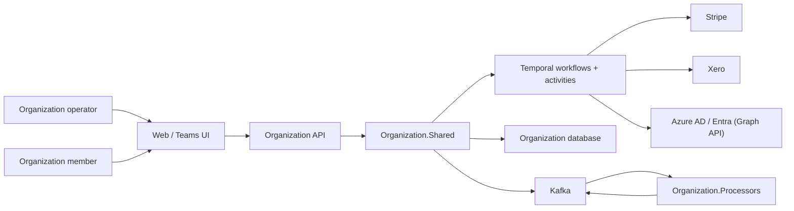
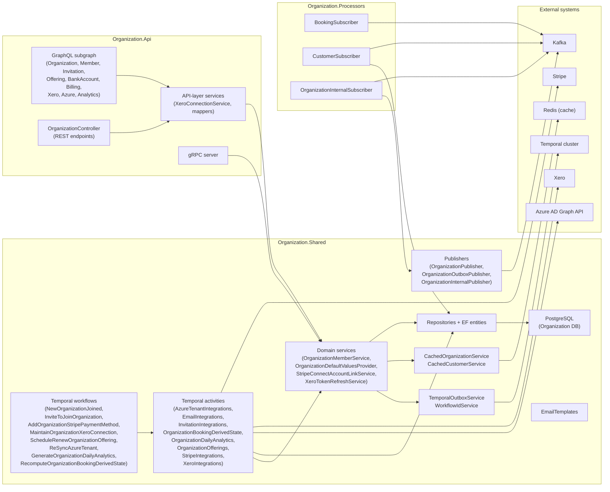
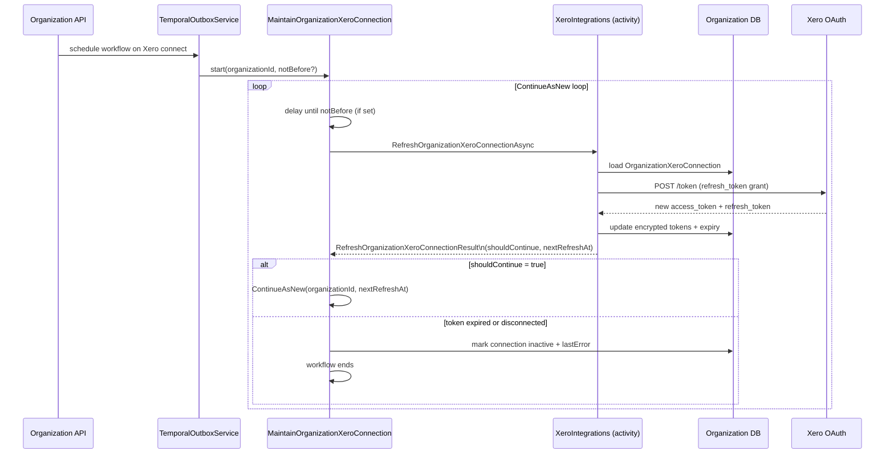
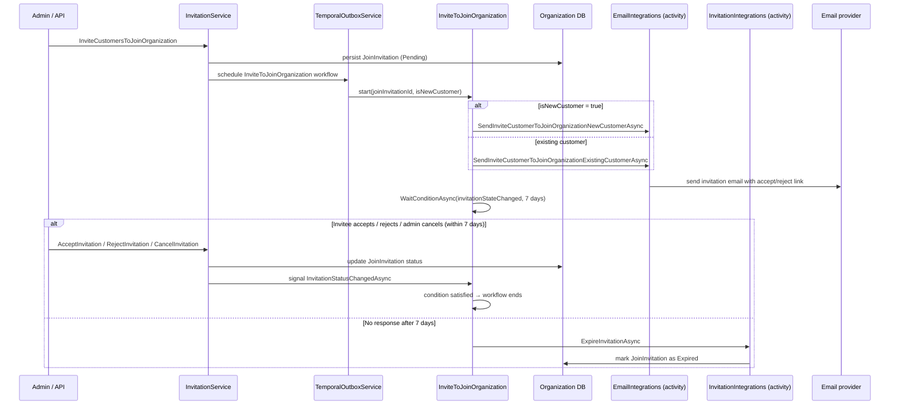
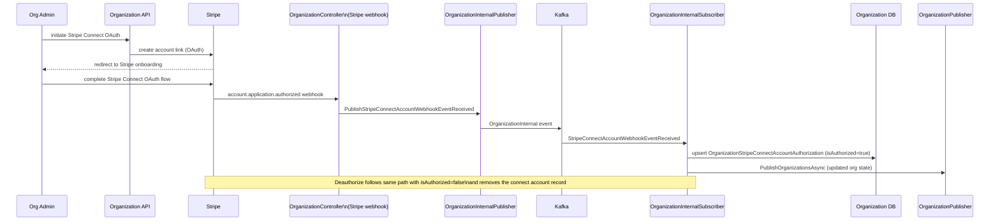
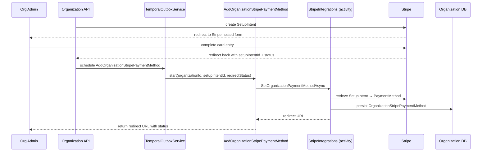
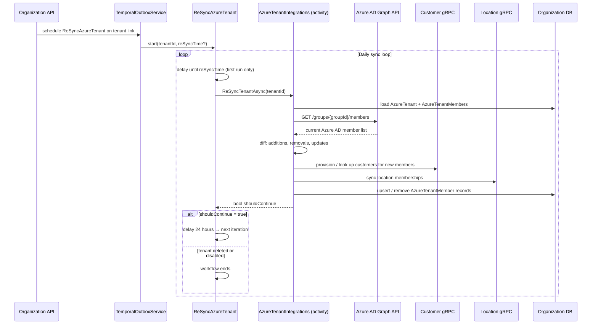
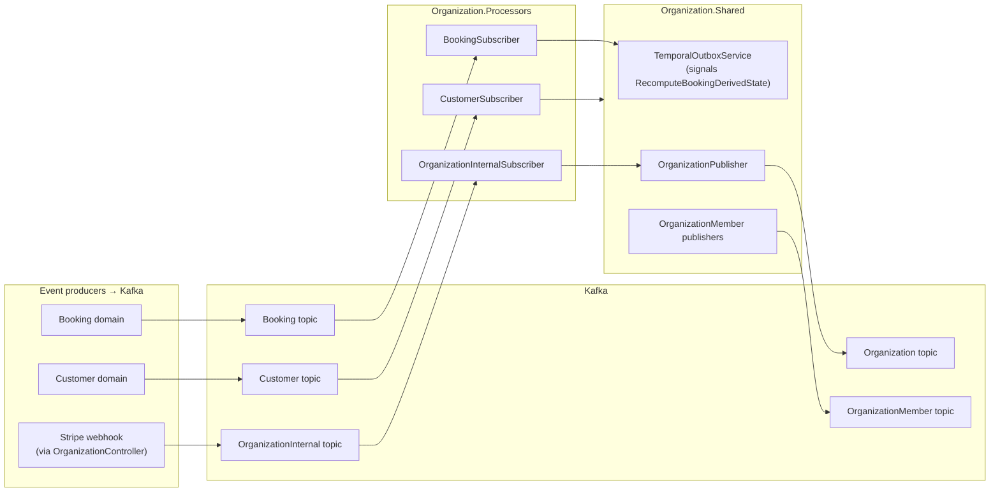

# Organization Domain Architecture

This document is a high-level architecture view of the Organization domain as it exists today.

It is intentionally C4-style rather than implementation-complete. The goal is to explain:

- how the organization domain anchors all other domains as the top-level tenant boundary
- how members, invitations, and offerings are managed
- how Temporal workflows drive onboarding, token refresh, offering renewal, Azure sync, and analytics
- how Stripe Connect accounts and Xero OAuth connections fit into the lifecycle
- how the domain reacts to events from Booking, Customer, and its own internal event stream

## Scope

This document covers the organization domain surfaces under:

- `organization/apis/Organization.Api`
- `organization/shared/Organization.Shared`
- `organization/processors/Organization.Processors`
- the organization-owned Temporal workflows and activities

It also references the external systems that the organization domain coordinates with:

- Stripe
- Xero
- Azure AD / Entra (via Microsoft Graph)
- Temporal
- Kafka

## Core Concepts

- `Organization`
    - The top-level tenant boundary in Skedular.
    - All locations, products, teams, and bookings belong to an organization.
    - Identified by either its internal ID or a human-readable custom domain.

- `OrganizationMember`
    - A customer who has joined an organization.
    - Members have roles (e.g. admin, member) and can complete onboarding steps.

- `JoinInvitation`
    - A pending or accepted invitation for a customer to join the organization.
    - Managed by the `InviteToJoinOrganization` Temporal workflow.

- `OrganizationOffering`
    - A feature license / subscription tier that the organization holds.
    - Renewals are scheduled via `ScheduleRenewOrganizationOffering`.

- `OrganizationStripeConnectAccount`
    - An organization's own Stripe account connected via OAuth.
    - Enables marketplace payments to flow into the organization's Stripe account.
    - Authorization state is maintained through Stripe webhook events.

- `OrganizationXeroConnection`
    - Stores the encrypted Xero OAuth refresh token for an organization.
    - Maintained by `MaintainOrganizationXeroConnection`, a long-lived Temporal workflow.

- `AzureTenant`
    - An Azure AD / Entra tenant linked to the organization for SSO and member sync.
    - Group membership is reconciled by `ReSyncAzureTenant`.

- `DailyBookingCountRecording` / `DailyMemberCountRecording`
    - Persisted analytics snapshots produced by `GenerateOrganizationDailyAnalytics`.

## Organization Field-Masked Updates

Organisation update contracts keep their normal `Update*` names. Their current organisation-domain implementation uses
field-masked patch semantics instead of full-object replacement: GraphQL setup editing calls `updateOrganization`, and
the specialised organisation GraphQL update mutations follow the same pattern for billing details, tax details, bank
accounts, offering selection, tags, Stripe Connect account metadata, Xero connection settings, and SSO settings.

Patch requests carry an explicit `fieldsToUpdate` enum list. The enum is the update mask: only fields named in that
list may change, and every omitted organisation value is preserved. This is required because nullable GraphQL input
values cannot distinguish "caller did not send this field" from "caller intentionally cleared this field".

The patch mapper owns applying selected setup fields to the organisation entity so the behaviour is reusable outside the
GraphQL resolver. It supports the editable setup fields previously sent by the GraphQL setup update path, including
name, description, title, subtitle, custom domain, public URLs, billing cycle, invoice due days, contact details, refund
notification recipients, industry subcategories, feature images, and marketplace listing metadata.

Successful field-masked update mutations return the existing payload shapes with the latest saved details. The setup UI
uses that payload to let Relay update other displayed fields without a success toast. While an inline text save is in
flight, the field shows an inline saving indicator; failures are surfaced through the existing toast path.

Concurrency remains owned by the entity layer. If persistence reports a concurrency conflict, the API reloads the latest
organisation and retries the same selected patch fields against that latest entity. The API does not expose an
`expectedVersion` argument.

Organisation gRPC billing details, tag, custom tag, product tag, and zone update RPCs use the same field-mask model.
Their RPCs keep their normal `Update*` names, but their inputs carry `fieldsToUpdate` and patch field enums so callers
cannot accidentally replace omitted values.

Organisation SSO settings use `updateOrganizationSsoSettings` with `fieldsToUpdate: [SSO_SETTINGS]` and still return
`OrganizationPayload`. SSO is patched as one aggregate field because entity id, login URL, federation metadata URL, and
active state are validated together against metadata and certificate checks.

## System Context

## Component Map

## Temporal Workflow Overview

```mermaid
flowchart TB
    subgraph Onboarding["Onboarding"]
        NOW["NewOrganizationJoined\n▸ sends welcome email"]
    end

    subgraph Membership["Membership"]
        INV["InviteToJoinOrganization\n▸ sends invitation email\n▸ waits up to 7 days for response\n▸ expires invitation if no response"]
    end

    subgraph Payments["Payments"]
        SPM["AddOrganizationStripePaymentMethod\n▸ resolves Stripe SetupIntent\n▸ persists payment method\n▸ returns redirect URL"]
    end

    subgraph Accounting["Accounting"]
        XWF["MaintainOrganizationXeroConnection\n▸ long-lived ContinueAsNew loop\n▸ refreshes Xero OAuth token\n▸ schedules next refresh"]
    end

    subgraph Offerings["Offerings"]
        OWF["ScheduleRenewOrganizationOffering\n▸ waits until renewal date\n▸ cancellable via signal\n▸ charges Stripe then renews offering"]
    end

    subgraph AzureSync["Azure AD"]
        AWF["ReSyncAzureTenant\n▸ daily loop\n▸ syncs group membership\n▸ provisions/removes members"]
    end

    subgraph Analytics["Analytics"]
        GDA["GenerateOrganizationDailyAnalytics\n▸ daily loop\n▸ records member + booking counts"]
        RDS["RecomputeOrganizationBookingDerivedState\n▸ debounce 10 s\n▸ recomputes org-level stats\n▸ drains additional signals"]
    end
```

## Key Workflow Sequence Diagrams

### MaintainOrganizationXeroConnection — Long-lived token refresh loop

This workflow runs indefinitely for any organization that has connected Xero. It uses
`ContinueAsNew` to avoid unbounded history growth.

### InviteToJoinOrganization — Email invitation flow

## Stripe Connect Account Flow

Organizations can connect their own Stripe accounts so that marketplace payments flow
directly into their Stripe destination account.

### Stripe Payment Method Setup

The `AddOrganizationStripePaymentMethod` workflow handles the async redirect-back flow from
Stripe's SetupIntent for storing a payment method on the organization.

## Azure AD Sync Flow

The `ReSyncAzureTenant` workflow runs daily to reconcile Azure AD group membership with
Skedular organization members. It provisions new members and removes members that have left
the group.

## Event Publication and Processor Subscriptions

### Events produced by Organization domain

| Kafka topic              | When published                                                                 |
|--------------------------|--------------------------------------------------------------------------------|
| `Organization`           | Organization created, updated, or deleted; Stripe connect state changes        |
| `OrganizationMember`     | Member joined, role changed, status changed, removed, onboarding completed     |
| `OrganizationInternal`   | Stripe Connect webhook payload forwarded for async processing                  |

### Events consumed by Organization.Processors

| Kafka topic              | Event types handled                          | Action                                                                        |
|--------------------------|----------------------------------------------|-------------------------------------------------------------------------------|
| `Booking`                | `BookingUpserted`, `BookingDeleted`          | Signals `RecomputeOrganizationBookingDerivedState` workflow for each involved org |
| `Customer`               | `CustomerUpserted`, `CustomerDeleted`        | Mirrors customer + identity data locally; links pending invitations to newly-seen customers |
| `OrganizationInternal`   | `StripeConnectAccountWebhookEventReceived`   | Parses Stripe event; updates connect account authorization state; re-publishes org event |

### Downstream consumers of Organization events

| Topic                  | Known consumers                                     |
|------------------------|-----------------------------------------------------|
| `Organization`         | Booking, Team, Location, Marketplace processors     |
| `OrganizationMember`   | Booking, Team processors                            |

## Reading Guide

| You want to understand…                              | Start here                                                                             |
|------------------------------------------------------|----------------------------------------------------------------------------------------|
| Overall component layout                             | [Component Map](#component-map)                                                        |
| How all workflows relate to each other               | [Temporal Workflow Overview](#temporal-workflow-overview)                              |
| Xero OAuth token lifecycle                           | [MaintainOrganizationXeroConnection](#maintainorganizationxeroconnection--long-lived-token-refresh-loop) |
| How invitations are sent and expire                  | [InviteToJoinOrganization](#invitetojoinorganization--email-invitation-flow)           |
| Stripe Connect account authorization                 | [Stripe Connect Account Flow](#stripe-connect-account-flow)                           |
| Payment method setup via SetupIntent                 | [Stripe Payment Method Setup](#stripe-payment-method-setup)                           |
| Azure AD group sync                                  | [Azure AD Sync Flow](#azure-ad-sync-flow)                                              |
| What events the domain produces and consumes         | [Event Publication and Processor Subscriptions](#event-publication-and-processor-subscriptions) |
| Xero token encryption boundary                       | `shared/Enterprise.Shared/Accounting` — `IXeroTokenEncryptionService`                 |
| Offering renewal / license billing                   | `Organization.Shared/Workflows/ScheduleRenewOrganizationOffering.cs`                  |
| Daily analytics recording                            | `Organization.Shared/Workflows/GenerateOrganizationDailyAnalytics.cs`                 |
| Booking stat recomputation (debounced)               | `Organization.Shared/Workflows/RecomputeOrganizationBookingDerivedState.cs`            |
