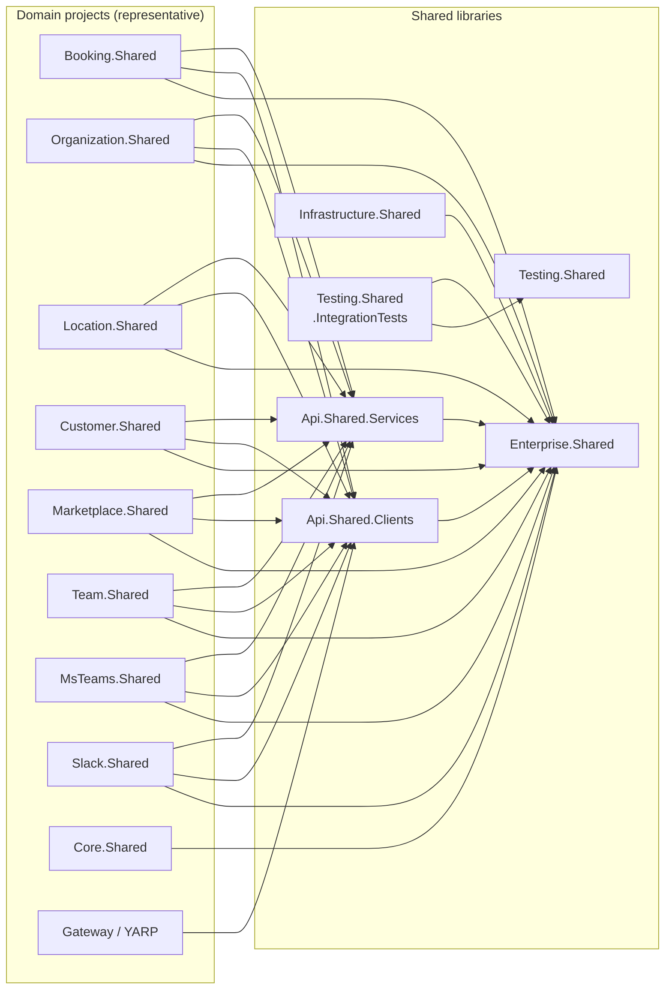
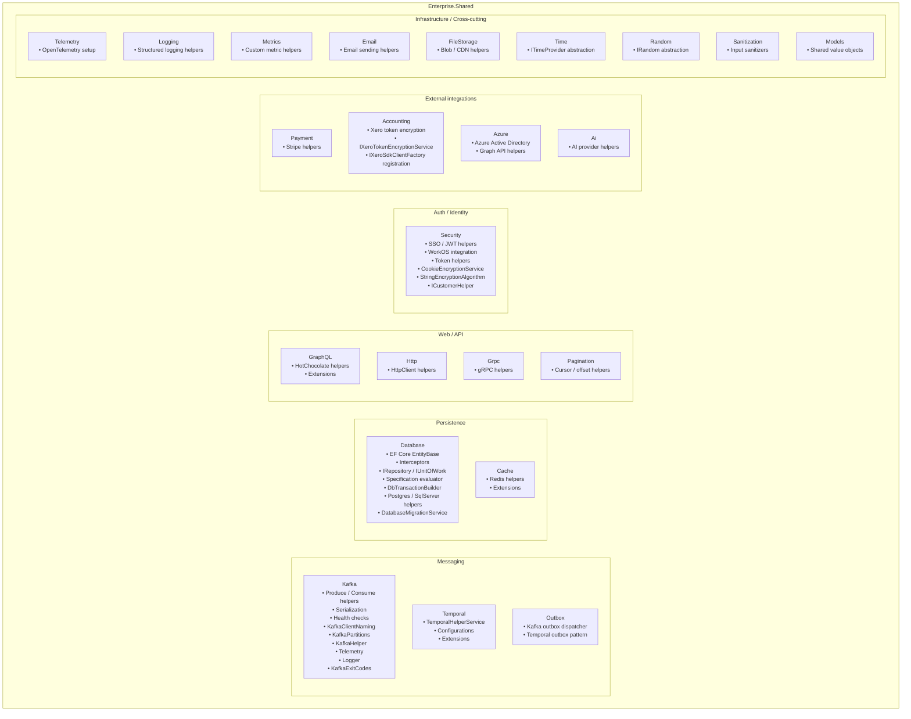
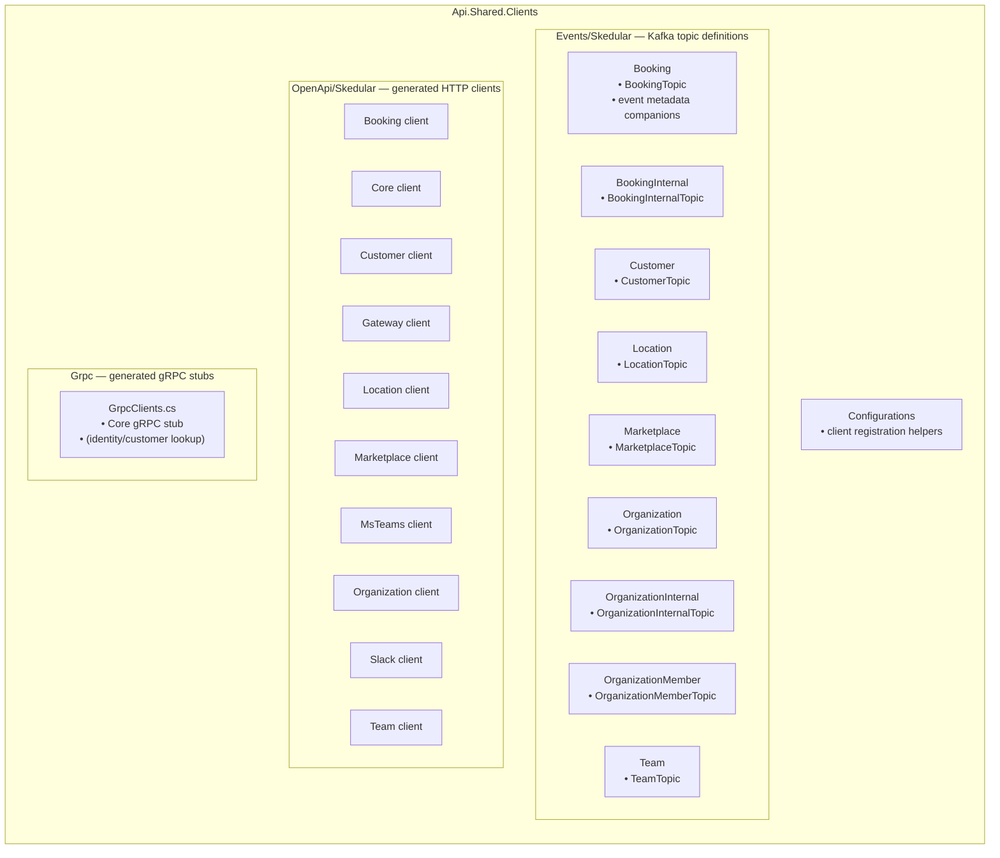
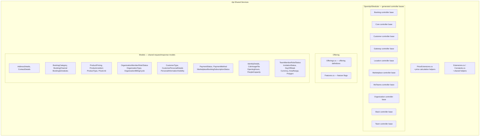
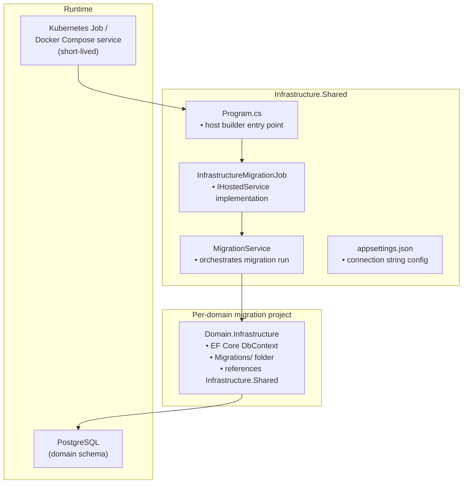
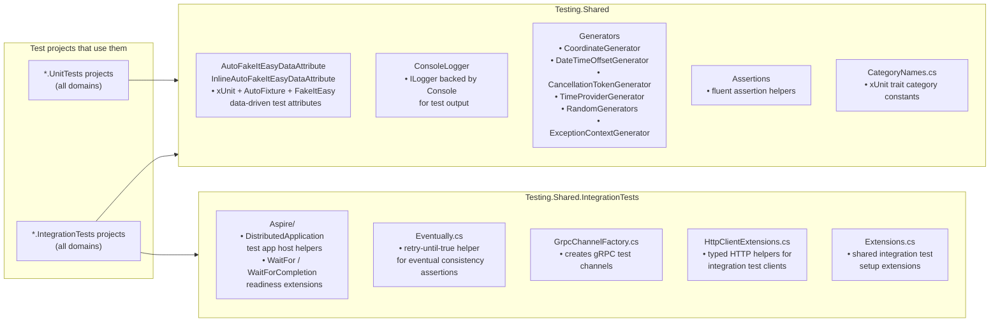

# Skedular Shared Libraries — Architecture

This document covers every shared library under `shared/`.  It explains their
responsibilities, how they depend on each other, which domain projects reference them,
and what the internal structure of each library looks like.

Read it alongside `docs/architecture/scheduler-overview.md` for the cross-domain picture.

---

## 1. Library Dependency Diagram

Arrows point from **consumer → dependency**.

---

## 2. Enterprise.Shared — Component Map

`Enterprise.Shared` is the foundational cross-cutting library.  Every domain shared
library and every infrastructure project depends on it.

---

## 3. Api.Shared.Clients — Layout

Generated HTTP clients, typed Kafka event definitions, and gRPC client stubs used by all
consumers of the domain APIs.

---

## 4. Api.Shared.Services — Layout

Generated OpenAPI controller base classes and shared service models used by all domain
API projects.

---

## 5. Infrastructure.Shared — Migration Host Pattern

`Infrastructure.Shared` is used as the database-migration host for every domain's schema.
Each domain runs it as a short-lived job that applies EF Core migrations and exits.

---

## 6. Testing.Shared and Testing.Shared.IntegrationTests

These libraries provide test infrastructure shared across all unit and integration test
projects.

---

## 7. Directory Reference

| Path | Library | Role |
|---|---|---|
| `shared/Enterprise.Shared/` | Enterprise.Shared | Foundational cross-cutting library |
| `shared/Enterprise.Shared/Kafka/` | Enterprise.Shared | Kafka produce/consume helpers |
| `shared/Enterprise.Shared/Temporal/` | Enterprise.Shared | Temporal configuration + helpers |
| `shared/Enterprise.Shared/Database/` | Enterprise.Shared | EF Core base entities, repositories, interceptors |
| `shared/Enterprise.Shared/Security/` | Enterprise.Shared | SSO, JWT, WorkOS, encryption |
| `shared/Enterprise.Shared/Cache/` | Enterprise.Shared | Redis helpers |
| `shared/Enterprise.Shared/GraphQL/` | Enterprise.Shared | HotChocolate helpers |
| `shared/Enterprise.Shared/Payment/` | Enterprise.Shared | Stripe helpers |
| `shared/Enterprise.Shared/Accounting/` | Enterprise.Shared | Xero token encryption, `AddXeroServices` |
| `shared/Enterprise.Shared/Azure/` | Enterprise.Shared | Azure Entra / Graph API helpers |
| `shared/Enterprise.Shared/Outbox/` | Enterprise.Shared | Kafka + Temporal outbox patterns |
| `shared/Enterprise.Shared/Telemetry/` | Enterprise.Shared | OpenTelemetry setup |
| `shared/Enterprise.Shared/Ai/` | Enterprise.Shared | AI provider helpers |
| `shared/Api.Shared.Clients/` | Api.Shared.Clients | Generated OpenAPI clients + event topics + gRPC stubs |
| `shared/Api.Shared.Clients/Events/Skedular/` | Api.Shared.Clients | Typed Kafka topic definitions (9 topics) |
| `shared/Api.Shared.Clients/OpenApi/Skedular/` | Api.Shared.Clients | Generated HTTP API clients (10 domains) |
| `shared/Api.Shared.Clients/Grpc/` | Api.Shared.Clients | Generated gRPC client stubs (Core) |
| `shared/Api.Shared.Services/` | Api.Shared.Services | Generated OpenAPI controller bases + shared models |
| `shared/Api.Shared.Services/OpenApi/Skedular/` | Api.Shared.Services | Generated controller base classes (10 domains) |
| `shared/Api.Shared.Services/Offering/` | Api.Shared.Services | Offering definitions + feature flags |
| `shared/Api.Shared.Services/Models/` | Api.Shared.Services | Shared request/response value objects |
| `shared/Infrastructure.Shared/` | Infrastructure.Shared | EF Core migration host (MigrationService + job) |
| `shared/Testing.Shared/` | Testing.Shared | xUnit unit test helpers (AutoFixture, generators, assertions) |
| `shared/Testing.Shared.IntegrationTests/` | Testing.Shared.IntegrationTests | Aspire integration test base, Eventually helper, gRPC/HTTP helpers |
