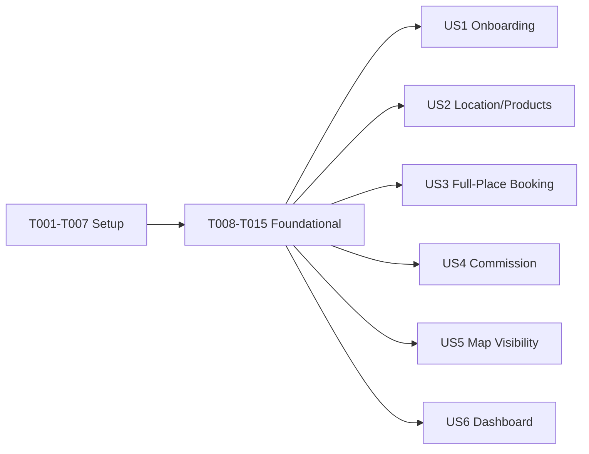

# Tasks: Skedualr Host App

**Input**: Design documents from `/specs/026-scheduler-host-app/`
**Prerequisites**: plan.md (required), spec.md (required for user stories), research.md, data-model.md, contracts/

## Format: `[ID] [P?] [Story] Description`

- **[P]**: Can run in parallel (different files, no dependencies)
- **[Story]**: Which user story this task belongs to (e.g., US1, US2, US3)
- Include exact file paths in descriptions

## Path Conventions

This is a web application with frontend and backend components:
- Backend: C# .NET 10 in shared modules
- Frontend: Next.js 16 App Router in `src/web/apps/webapp-host/`
- Shared UI: `@skedular/ui` package
- Shared runtime: `@skedular/shared` package

---

## Phase 1: Setup (Shared Infrastructure)

**Purpose**: Project initialization and basic structure

- [X] T001 Create web app project structure at `src/web/apps/webapp-host/`
- [X] T002 Initialize Next.js 16 App Router project with required dependencies
- [X] T003 [P] Configure Relay for GraphQL queries (match existing app patterns)
- [X] T004 [P] Configure MUI theme extending `@skedular/ui` design tokens
- [X] T005 [P] Set up TypeScript configuration (`tsconfig.json`)
- [X] T006 [P] Configure linting with ESLint + Prettier (match existing apps)
- [X] T007 Setup vitest for unit tests and Playwright for E2E

---

## Phase 2: Foundational (Blocking Prerequisites)

**Purpose**: Core infrastructure that MUST be complete before ANY user story can be implemented

- [X] T008 Add `Host` enum value to `OrganizationType` in `src/shared/Api.Shared.Services/Models/OrganizationType.cs`
- [X] T009 Update `OrganizationTypeConstants` with `Host = "HOST"` constant
- [X] T010 [P] Add versioned `HostCommissionPercentage` to Organization-owned `OrganizationOffering`
- [X] T011 Create `IAutoResourceService` interface in `src/location/shared/Location.Shared/Services/AutoResourceService.cs`
- [X] T012 Implement `AutoResourceService` that idempotently creates the hidden Entire Location Resource and associates the Location Product Tag in `src/location/shared/Location.Shared/Services/AutoResourceService.cs`
- [X] T013 Register `AutoResourceService` in DI container (register per plan)
- [X] T014 [P] Reuse repository-wide request context enrichment and correlation propagation for Host structured logs
- [X] T015 Define `HostStandardV1` in the Organization pricing catalog with a 5% commission

**Checkpoint**: Foundation ready - user story implementation can now begin

---

## Phase 3: User Story 1 - Host Onboarding & Organization (Priority: P1) 🎯 MVP

**Goal**: Enable individuals to create a verified Host organization and complete initial setup

**Independent Test**: A new user can create a Host org, have it verified by admin, and see the verification status change

### Implementation for User Story 1

- [X] T016 [P] [US1] Extend `AddOrganization` GraphQL schema to support `Host` type in `api-definitions/graphql/`
- [X] T017 [P] [US1] Generate Relay artifacts for organization creation query after schema changes
- [X] T018 [US1] Allow unverified Hosts to manage drafts but prevent Product activation and public discovery until ownership is verified in the canonical Marketplace and Location services
- [X] T019 [US1] Implement admin verification endpoint for Host organizations in `src/organization/apis/Organization.Api/Controllers/Admin/OrganizationVerificationController.cs`
- [X] T020 [US1] Add structured Host organization creation and ownership-verification lifecycle logs in canonical Organization services

**Checkpoint**: Host can register, admin can verify, verified status is persisted

---

## Phase 4: User Story 2 - Location & Product Listing (Priority: P1)

**Goal**: Allow verified Hosts to create Locations and Products; system auto-creates Resources

**Independent Test**: A verified Host creates a Location → creates a Product → Resource is auto-created with correct naming and tags

### Implementation for User Story 2

- [X] T021 [P] [US2] Create Location creation page at `src/web/apps/webapp-host/src/app/locations/create/page.tsx`
- [X] T022 [P] [US2] Create Product creation page at `src/web/apps/webapp-host/src/app/locations/[id]/products/create/page.tsx`
- [X] T023 [US2] Reuse tenant-authorized canonical Location GraphQL CRUD for Host organizations and wire webapp-host Location mutations
- [X] T024 [US2] Extend canonical Marketplace GraphQL Product CRUD for Host organizations, requiring the Location-provisioned Product Tag, and wire webapp-host Product mutations
- [X] T025 [P] [US2] Create product form component at `src/web/apps/webapp-host/src/components/product-form/ProductForm.tsx`
- [X] T026 [US2] Start an idempotent Temporal workflow when a Host Location is created to create its Product Tag through Organization and its hidden Entire Location Resource through Location
- [X] T027 [P] [US2] Implement Location list page at `src/web/apps/webapp-host/src/app/locations/page.tsx`
- [X] T028 [P] [US2] Implement Product list page per Location at `src/web/apps/webapp-host/src/app/locations/[id]/products/page.tsx`
- [X] T058 [US2] Extend the Marketplace gRPC contract with authenticated idempotent Host draft Product provisioning and removal operations
- [X] T059 [US2] Extend `ProvisionHostLocation` to provision one deterministic inactive Product after the Product Tag and hidden Resource exist
- [X] T060 [US2] Coordinate Host Location removal with asynchronous removal of the provisioned Product while preserving soft-deleted booking infrastructure and history
- [X] T061 [US2] Replace Host's Location-picker Product creation flow with the Spaces-style organization Product experience, showing one provisioned draft per Location and location-specific pricing/policy editing
- [X] T062 [US2] Prevent Host Product activation until the provisioned draft has complete listing, card pricing, and cancellation-policy configuration

**Checkpoint**: Host can create Locations and Products; Resources are visible in DB but not to Host

---

## Phase 5: User Story 3 - Full-Place Booking via Event Type (Priority: P1)

**Goal**: Ensure Host bookings reserve entire Location, not individual Resources

**Independent Test**: Guest books a Host Product → entire Location becomes unavailable for overlapping dates

### Implementation for User Story 3

- [X] T029 [P] [US3] Enforce `ProductType.Event` as the canonical Marketplace Product type for Host organizations
- [X] T030 [US3] Enforce full-place Event booking for Host Products in the canonical Marketplace booking service
- [X] T031 [P] [US3] Create booking page at `src/web/apps/webapp-host/src/app/bookings/new/page.tsx` (scaffolded from Spaces)
- [X] T032 [US3] Reject non-Event Host Products at the canonical Marketplace booking boundary

**Checkpoint**: Booking a Host Product reserves entire Location; conflict detection works

---

## Phase 6: User Story 4 - Host Pricing & Commission (Priority: P1)

**Goal**: Calculate and charge 5% commission on booking value to Hosts

**Independent Test**: Complete a booking → verify 5% commission is calculated and added to invoice

### Implementation for User Story 4

- [X] T033 [P] [US4] Add Booking-owned Host commission calculation and durable booking accounting fields
- [X] T034 [US4] Persist organization-configured Host commission and apply it as the Stripe Connect application fee in Booking-owned payment generation
- [X] T035 [P] [US4] Create Relay-backed Host dashboard with Location, Product, Booking, commission, and payout summaries
- [X] T036 [P] [US4] Implement Relay-backed commission history with booking value, rate, commission, and Host payout
- [X] T037 [US4] Add structured Booking-owned audit logging for Host commission, payout, booking, and rate

**Checkpoint**: Commission is calculated on each booking; dashboard shows history

---

## Phase 7: User Story 5 - Map Visibility on Webapp (Priority: P2)

**Goal**: Host Locations appear on Spaces map with distinct badge and filter

**Independent Test**: Open webapp map → see Host locations with "HOST" badge → filter by organization type works

### Implementation for User Story 5

- [X] T038 [P] [US5] Extend the marketplace Location card GraphQL fragment to include `organization.type` and regenerate Relay artifacts
- [X] T039 [P] [US5] Add a distinct Host marker to the canonical marketplace map
- [X] T040 [P] [US5] Add All/Hosts/Spaces organization-type filtering to the canonical marketplace map
- [X] T041 [US5] Show a Host badge for Host-type Locations in the canonical marketplace card rendering

**Checkpoint**: Host locations visible on map with badge; filtering by org type works

---

## Phase 8: User Story 6 - Host Dashboard & Management (Priority: P2)

**Goal**: Provide Host with management interface for Locations, Products, bookings, and commission history

**Independent Test**: Host logs in → sees dashboard with stats → can update prices → views booking history

### Implementation for User Story 6

- [X] T042 [P] [US6] Create host dashboard layout component at `src/web/apps/webapp-host/src/components/dashboard-layout/DashboardLayout.tsx`
- [X] T043 [P] [US6] Implement location management card component at `src/web/apps/webapp-host/src/components/location-card/LocationCard.tsx`
- [X] T044 [P] [US6] Implement product management table at `src/web/apps/webapp-host/src/components/product-table/ProductTable.tsx`
- [X] T045 [US6] Reuse tenant-authorized canonical Booking GraphQL history query filtered by Host organization
- [X] T046 [P] [US6] Implement pricing update flow at `src/web/apps/webapp-host/src/app/products/[id]/edit/page.tsx`

**Checkpoint**: Complete dashboard with stats, location management, product updates

---

## Phase 9: Polish & Cross-Cutting Concerns

**Purpose**: Final polish, documentation, and cross-cutting updates

### Documentation & Config

- [X] T047 Update README at `src/web/apps/webapp-host/README.md` with feature summary
- [X] T048 Add Host organization type to docs in `docs/event-catalog/commands/Organization/AddOrganization/schema.json`
- [X] T049 Document canonical Host GraphQL operations and domain boundaries in `api-definitions/graphql/HOST.md`

### Testing & Validation

- [X] T050 Run Host E2E coverage that verifies canonical Location/Product mutations plus booking history, commission, and payout flows
- [X] T051 Validate correlation enrichment, organization verification, hidden-resource, and commission logging paths with focused unit tests
- [X] T052 Verify commission calculation accuracy with test scenarios

### Deployment & Infrastructure

- [X] T053 Create Dockerfile at `src/web/apps/webapp-host/Dockerfile`
- [X] T054 Setup infrastructure configuration in `src/web/apps/webapp-host/infrastructure/`

**Checkpoint**: All tests pass; documentation complete; ready for deployment

---

## Dependencies (Task Ordering)

## Parallel Execution Examples

Per user story (each story can implement independently once foundational phase is complete):

| Story | Parallel Tasks |
|-------|---------------|
| US1 | T016, T017, T018, T019 |
| US2 | T021, T022, T025, T027, T028 |
| US3 | T029, T031 |
| US4 | T033, T035 |
| US5 | T038, T039, T040 |
| US6 | T042, T043, T044, T046 |

---

## MVP Scope

**Phase 1 + Phase 2 + User Story 1-4 only**

Minimum viable product includes:
- Setup and foundational infrastructure (T001-T015)
- Host registration and verification (US1: T016-T020)
- Location/Product creation with auto-Resources (US2: T021-T028)
- Full-place booking (US3: T029-T032)
- Commission calculation (US4: T033-T037)

This enables:
1. Host registration and admin verification
2. Location creation and product listing
3. Bookings that reserve entire Locations
4. 5% commission charged on bookings
