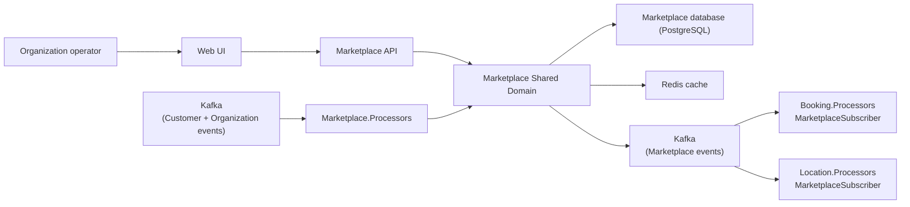
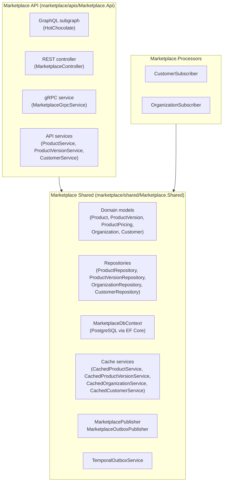
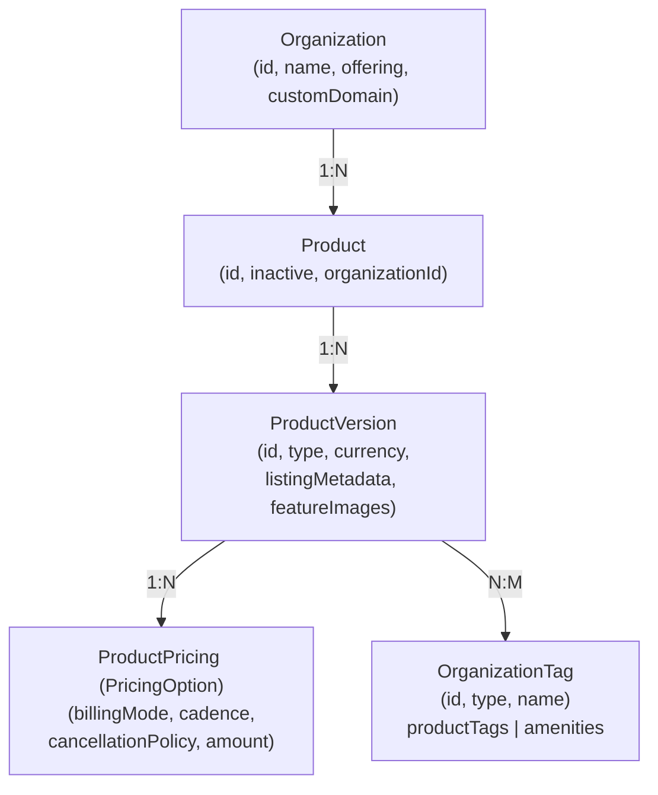
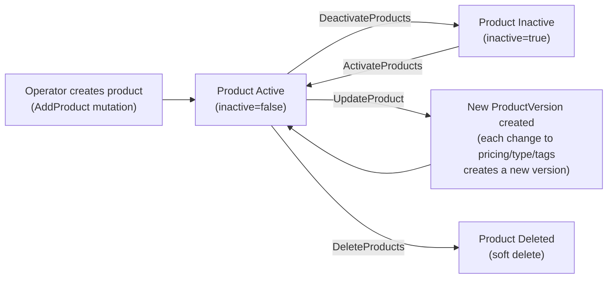
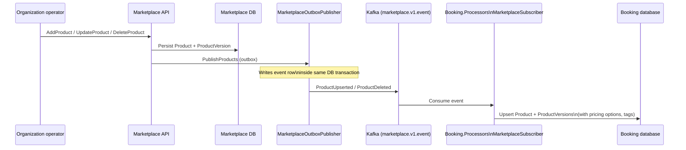
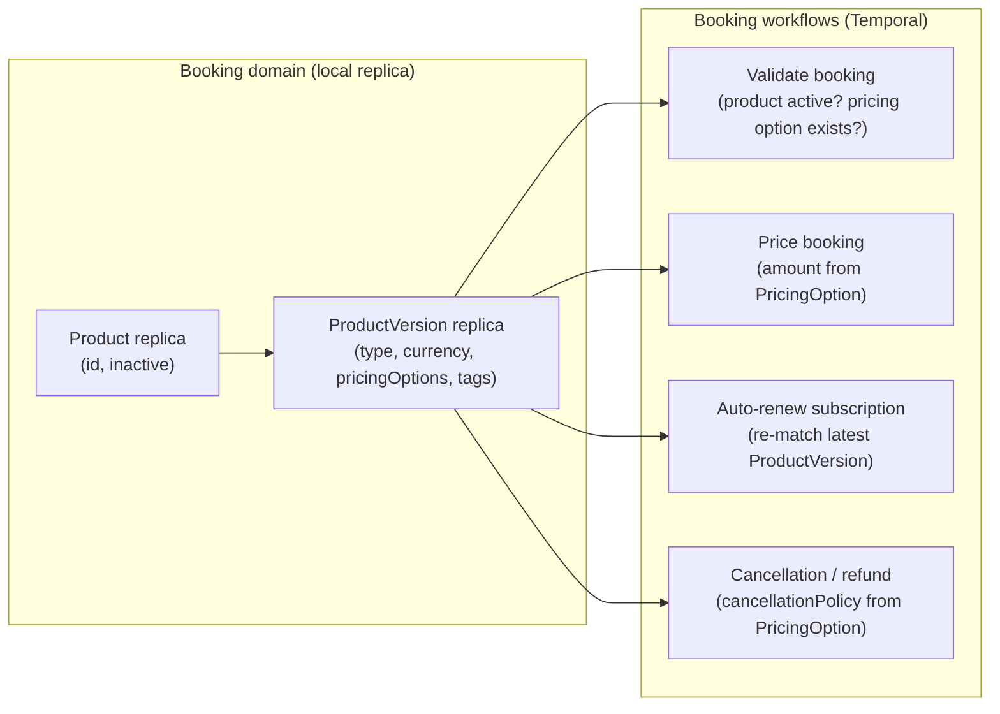
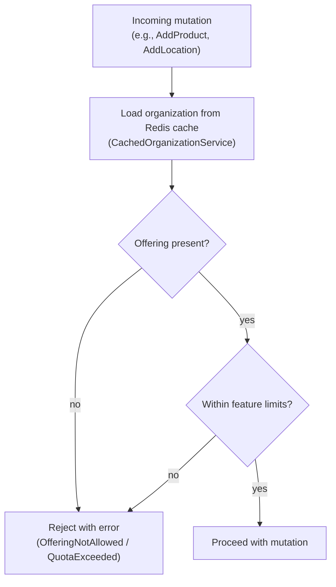
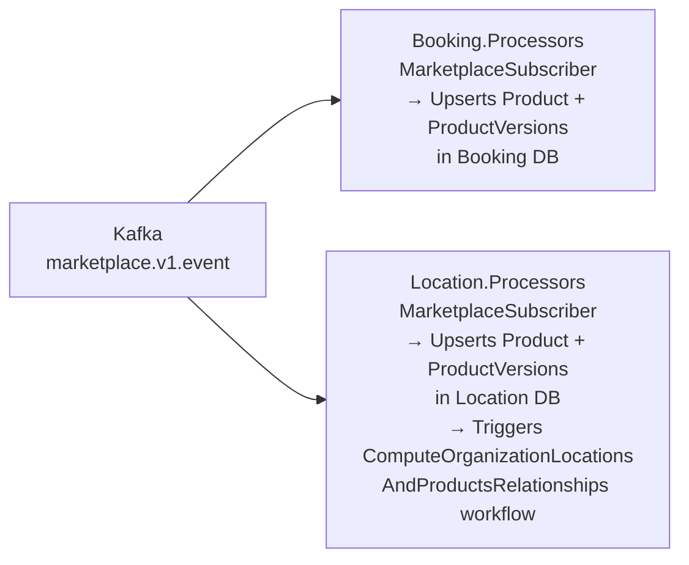
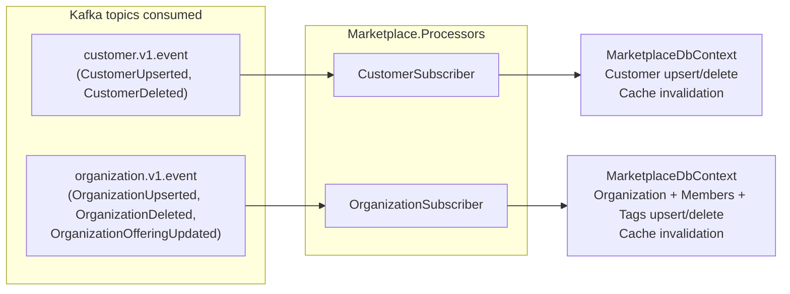

# Marketplace Domain Architecture

This document is a high-level architecture view of the Marketplace domain as it exists today.

It is intentionally C4-style rather than implementation-complete. The goal is to explain:

- how the product catalogue is structured and versioned
- how products flow from the marketplace into the booking domain
- how the offering/feature-flag system controls which marketplace capabilities are available per organization
- how Kafka events carry product changes to downstream consumers
- how the marketplace domain reacts to customer and organization events

## Scope

This document covers the marketplace domain surfaces under:

- `marketplace/apis/Marketplace.Api`
- `marketplace/shared/Marketplace.Shared`
- the marketplace processors under `marketplace/processors/Marketplace.Processors`

It also references the sibling domains that consume marketplace data:

- Booking domain (reads product versions and pricing to validate and price bookings)
- Location domain (reads products to compute location–product relationships)

---

## Purpose & Scope

The Marketplace domain is the **product catalogue** for the Skedular platform. It owns:

- **Products** — the top-level bookable offering an organization publishes (e.g., a hot-desk pass, a meeting-room
  bundle).
- **ProductVersions** — immutable snapshots of a product's configuration at a point in time. A product can accumulate
  multiple versions; the latest version is the active definition used by booking.
- **PricingOptions** — per-product-version pricing rules (one-time vs recurring, card vs bank-transfer vs in-arrears,
  billing cadence, cancellation policy).
- **Offering** — per-organization feature flags and quotas that control which marketplace capabilities are accessible
  (see §5).

The marketplace domain acts primarily as a **catalogue and read model**. It does not own Temporal workflows; its
state changes are driven by REST/GraphQL mutations from operators and propagated to downstream domains entirely
through Kafka events.

---

## Core Concepts

- `Product`  
  Top-level entity scoped to an organization. Can be active or inactive. Carries tags (`productTags`, `amenities`)
  used to match resources at locations.

- `ProductVersion`  
  Immutable versioned snapshot of a product's type, currency, feature images, listing metadata, pricing options, and
  organization tags. The most recent version is the `latestProductVersionId` exposed on `ProductDetails`.

- `ProductPricing` (PricingOption)  
  A single pricing rule on a product version. Defines:
  - `BillingMode` — card, bank-transfer, or in-arrears
  - `Cadence` — one-time, daily, weekly, monthly, quarterly, yearly
  - `CancellationPolicy` — the refund eligibility rules applied on cancellation
  - Amount and currency

- `Organization` (local replica)  
  A lightweight replica of the owning organization, kept current by consuming Organization Kafka events.

- `Customer` (local replica)  
  A lightweight replica of customer identity data, kept current by consuming Customer Kafka events.

- `Offering`  
  The active subscription tier for an organization, defined in `Api.Shared.Services.Offering`. Controls location
  limits, team limits, user limits, and feature-set access.

---

## System Context



---

## Container View



---

## Directory Layout

```
marketplace/
├── apis/
│   └── Marketplace.Api/
│       ├── Controllers/MarketplaceController.cs    # REST endpoints
│       ├── GraphQL/
│       │   └── Product/                            # Product queries/mutations
│       │       ├── ProductDetails.cs
│       │       ├── ProductVersionDetails.cs
│       │       ├── ProductPricingBillingModeDetails.cs
│       │       ├── ProductPricingCadenceDetails.cs
│       │       ├── ProductPricingCancellationTypeDetails.cs
│       │       └── RootQuery.cs / RootMutation.cs
│       ├── Grpc/MarketplaceGrpcService.cs          # gRPC (GraphQL topic + version)
│       ├── Mappers/Mapper.cs
│       └── Services/
│           ├── Authorization/
│           │   ├── OrganizationAuthorizationService.cs
│           │   └── OrganizationSsoAuthorizationService.cs
│           ├── ProductService.cs
│           ├── ProductVersionService.cs
│           └── CustomerService.cs
├── shared/
│   └── Marketplace.Shared/
│       ├── Database/
│       │   ├── Entities/                           # EF Core entities
│       │   │   ├── Product.cs
│       │   │   ├── ProductVersion.cs
│       │   │   ├── Organization.cs
│       │   │   └── Customer.cs
│       │   ├── Migrations/
│       │   └── MarketplaceDbContext.cs
│       ├── Mappers/Mapper.cs
│       ├── Models/
│       │   ├── Product.cs
│       │   ├── ProductVersion.cs
│       │   └── ProductSearch.cs
│       ├── Publishers/
│       │   ├── MarketplacePublisher.cs
│       │   └── MarketplaceOutboxPublisher.cs
│       ├── Repositories/
│       │   ├── ProductRepository.cs
│       │   ├── ProductVersionRepository.cs
│       │   └── RepositoryFactory.cs
│       └── Services/
│           ├── Cache/
│           │   ├── CachedProductService.cs
│           │   ├── CachedProductVersionService.cs
│           │   ├── CachedOrganizationService.cs
│           │   └── CachedCustomerService.cs
│           └── TemporalOutboxService.cs
├── domain/
│   ├── Marketplace.Domain.AppHost/AppHost.cs       # Aspire app host
│   ├── Marketplace.Domain.FakeDependencies/
│   └── Marketplace.Domain.IntegrationTests/
├── jobs/
│   └── Marketplace.Jobs/                           # Scheduled jobs
└── processors/
    └── Marketplace.Processors/
        └── Subscribers/
            ├── CustomerSubscriber.cs
            └── OrganizationSubscriber.cs
```

---

## Product Catalogue Model

### Entity relationships



### Product lifecycle



### ProductVersion fields

| Field | Description |
|---|---|
| `type` | Product type (e.g., `DayPass`, `HotDesk`, `MeetingRoom`, …) |
| `currency` | ISO currency code for all pricing on this version |
| `pricingOptions` | Collection of `ProductPricing` rules (see below) |
| `productTags` | Organization tags of type `Product` — used for location matching |
| `amenities` | Organization tags of amenity types — surfaced in listing UI |
| `featureImages` | CDN image references for the product listing |
| `listingMetadata` | Name, description, and other display metadata |

### ProductPricing fields

| Field | Description |
|---|---|
| `billingMode` | `Card`, `BankTransfer`, or `InArrears` |
| `purchaseCadence` | `Daily`, `Weekly`, `Fortnightly`, `Monthly`, `TwoMonths`, `Quarterly`, `FourMonths`, `FiveMonths`, `SixMonths`, `Yearly`; `NotSet` for credit entitlements |
| `cancellationType` | Cancellation policy type (determines refund eligibility) |
| Amount fields | Unit price in the product version's currency |

---

## How Marketplace Products Are Consumed by the Booking Domain

The booking domain does **not** call the Marketplace API at booking time. Instead it maintains a local replica of
product and product version data, kept current by consuming Marketplace Kafka events.



Once the local replica is in place, the booking domain can:

1. **Validate a booking** — look up the product version to confirm the product is active and the selected pricing
   option exists.
2. **Price a booking** — read the `ProductPricing` cadence and amount to calculate the charge.
3. **Apply cancellation policy** — use the `cancellationType` from the pricing option to determine refund eligibility
   at cancellation time.
4. **Drive auto-renewal** — match the latest `ProductVersion` pricing options when a subscription renews to ensure
   the renewed cycle uses current pricing.



The Location domain similarly maintains a local product replica to drive the
`ComputeOrganizationLocationsAndProductsRelationships` workflow (see Location Domain Architecture).

---

## Offering / Feature-Flag System

Offerings are defined statically in `Api.Shared.Services.Offering` and assigned per organization by the Organization
domain. The Marketplace API enforces offering constraints at the API layer.

### Offering tiers

| Code | Name | Location limit | User limit | Key features |
|---|---|---|---|---|
| `FreeTierV1` | Basic | 1 | 10 | One location, one team, unlimited bookings |
| `EarlyBirdV1` | Early bird | ∞ | ∞ | All features, free |
| `PayAsYouGoV1` | Pay as you go | — | — | Configurable per plan |
| `EnterpriseCustomV1` | Enterprise | ∞ | ∞ | All features, custom pricing |

### Feature set codes

| Code | Description |
|---|---|
| `OrganizationUpToOneLocation` | Restricted to a single location |
| `OrganizationUpToOneTeam` | Restricted to a single team |
| `OrganizationUnlimitedLocations` | No location limit |
| `OrganizationUnlimitedTeams` | No team limit |
| `OrganizationUnlimitedBookings` | No booking limit |
| `OrganizationCompanyResources` | Can manage company-wide resources |
| `OrganizationAnalytics` | Access to analytics dashboards |
| `OrganizationPremiumSupport` | Premium support tier |

### Offering enforcement flow



The `OrganizationOfferingUpdated` Kafka event (emitted by the Organization domain) is received by both
`Marketplace.Processors.OrganizationSubscriber` and `Location.Processors.OrganizationSubscriber`. Both processors
currently acknowledge the event without side-effects, because offering enforcement is read from the cached
organization object (which is updated by `OrganizationUpserted` events).

---

## Event Publication

The marketplace domain publishes two Kafka event types via `MarketplacePublisher` (direct) and
`MarketplaceOutboxPublisher` (transactional outbox):

| Event type | Condition | Key field |
|---|---|---|
| `ProductUpserted` | Product created or updated | `productId` |
| `ProductDeleted` | Product soft-deleted | `productId` |

Both publishers emit to the `marketplace.v1.event` Kafka topic.  
`MarketplaceOutboxPublisher` writes event rows inside the same database transaction as the domain mutation,
guaranteeing at-least-once delivery.

### Consumers of marketplace events



---

## Processor Subscriptions

`Marketplace.Processors` consumes events from two Kafka topics:



### Subscriber responsibilities

| Subscriber | Events handled | Effect |
|---|---|---|
| `CustomerSubscriber` | `CustomerUpserted`, `CustomerDeleted` | Upserts/removes customer + identities in local DB; invalidates customer cache |
| `OrganizationSubscriber` | `OrganizationUpserted`, `OrganizationDeleted` | Upserts/removes organization, members, tags, SSO settings in local DB; invalidates organization cache |
| `OrganizationSubscriber` | `OrganizationOfferingUpdated` | Acknowledged, no current side-effect (offering read from cached organization) |

---

## Reading Guide

| You want to understand… | Start here |
|---|---|
| How a product and its pricing are structured | `Marketplace.Shared/Models/Product.cs` + `ProductVersion.cs` |
| How products are exposed via GraphQL | `Marketplace.Api/GraphQL/Product/ProductDetails.cs` + `ProductVersionDetails.cs` |
| How products are published as Kafka events | `Marketplace.Shared/Publishers/MarketplacePublisher.cs` + `MarketplaceOutboxPublisher.cs` |
| How booking consumes product versions | `Booking.Processors/Subscribers/MarketplaceSubscriber.cs` |
| How location uses product tags to build location–product relationships | `Location.Processors/Subscribers/MarketplaceSubscriber.cs` + Location Domain Architecture |
| How offering tiers and feature sets are defined | `shared/Api.Shared.Services/Offering/Offerings.cs` + `Features.cs` |
| How the organization replica is maintained | `Marketplace.Processors/Subscribers/OrganizationSubscriber.cs` |
| How the customer replica is maintained | `Marketplace.Processors/Subscribers/CustomerSubscriber.cs` |
| How the gRPC surface (GraphQL topic signalling) works | `Marketplace.Api/Grpc/MarketplaceGrpcService.cs` |
