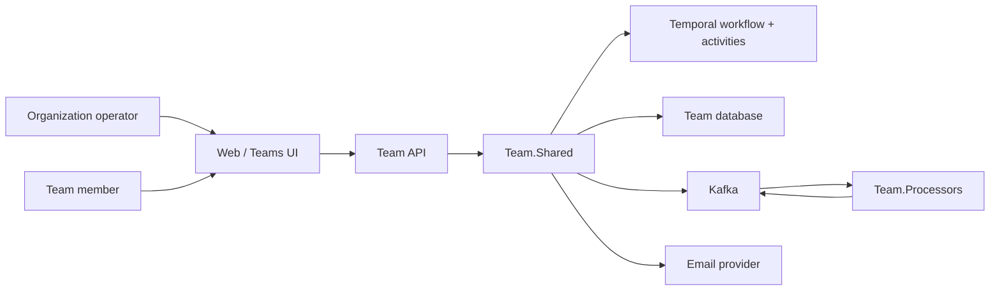
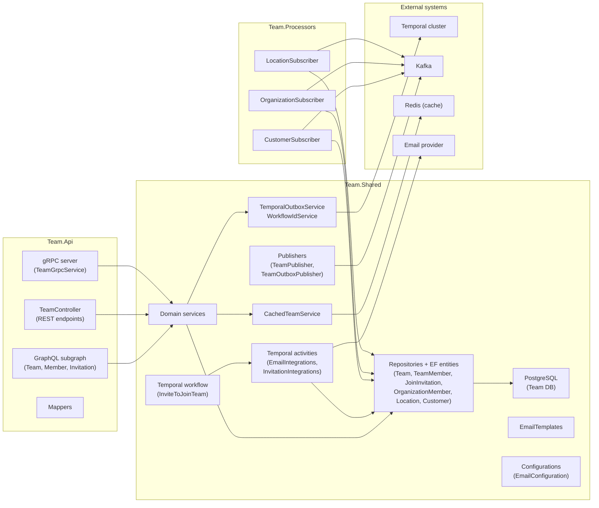
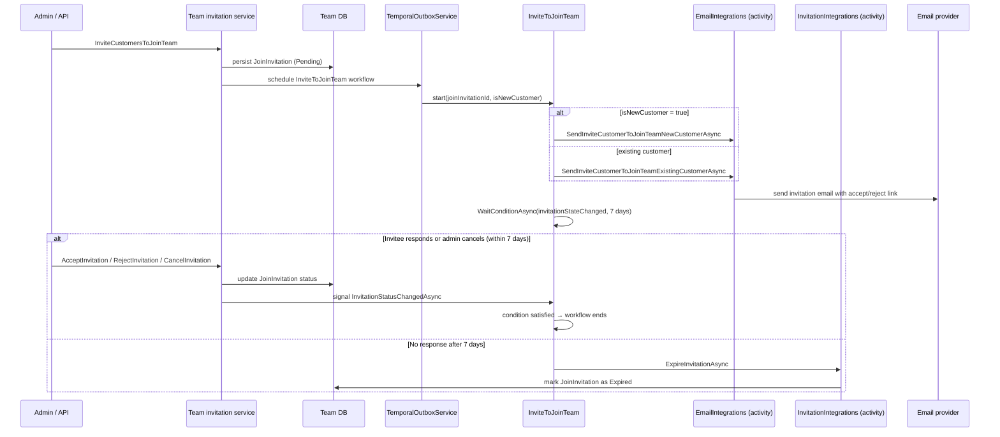
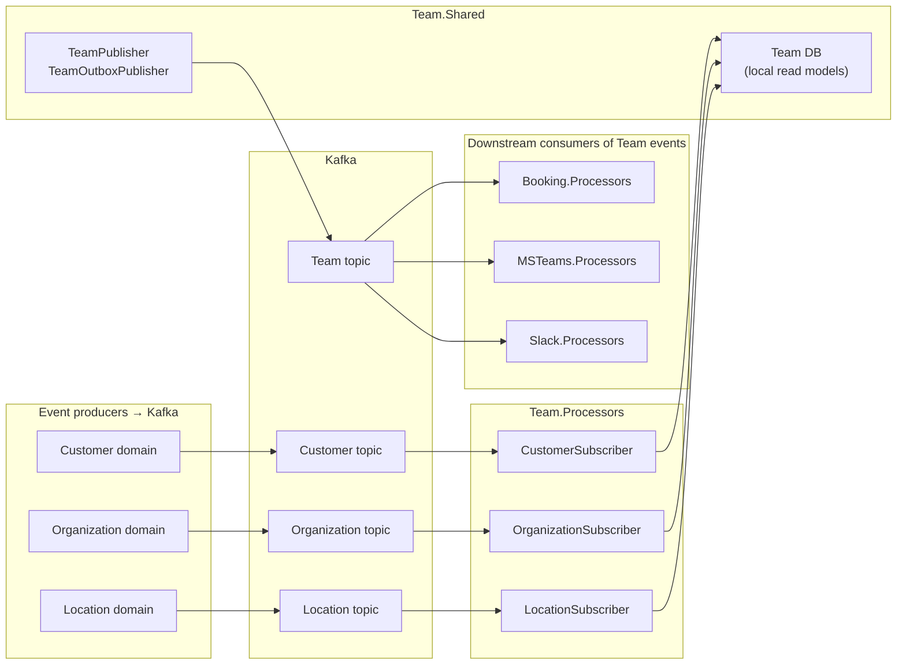
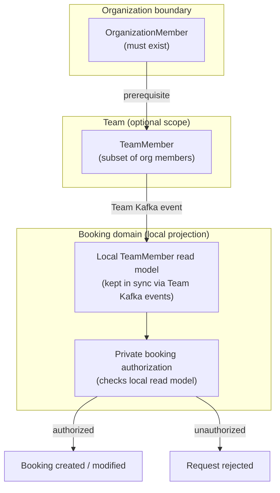

# Team Domain Architecture

This document is a high-level architecture view of the Team domain as it exists today.

It is intentionally C4-style rather than implementation-complete. The goal is to explain:

- how teams are created and managed within an organization
- how team membership and invitations are handled
- how the Temporal workflow drives the invitation email lifecycle
- how the domain reacts to events from Customer, Location, and Organization
- how team membership is used by the Booking domain for private booking authorization

## Scope

This document covers the team domain surfaces under:

- `team/apis/Team.Api`
- `team/shared/Team.Shared`
- `team/processors/Team.Processors`
- the team-owned Temporal workflow and activities

It also references:

- the Booking domain, which consumes Team events for authorization checks
- the MS Teams and Slack integrations, which consume Team events for channel/group management

## Core Concepts

- `Team`
    - A named group of members within an organization.
    - Belongs to exactly one organization and optionally one location.
    - Used to scope private booking access.

- `TeamMember`
    - A member of a team, always a subset of the parent organization's members.
    - Has a role within the team (e.g. admin, member).

- `JoinInvitation`
    - A pending or accepted invitation for a customer to join a team.
    - Managed by the `InviteToJoinTeam` Temporal workflow.

- `OrganizationMember` (local read model)
    - A local projection of organization membership state, kept in sync via Kafka events.
    - Used to validate that a team member is still an active org member.

- `Location` (local read model)
    - A local projection of location data, kept in sync via Kafka events.
    - Teams may be scoped to a location; the local record ensures referential integrity.

## System Context

## Component Map

## InviteToJoinTeam — Temporal Workflow Sequence

The `InviteToJoinTeam` workflow mirrors the organization invitation pattern. It sends
a typed invitation email (new customer vs. existing customer variant), waits up to 7 days
for a response signal, and expires the invitation if none arrives.

## Event Publication and Subscriptions

### Events produced by Team domain

| Kafka topic | When published                                                         |
|-------------|------------------------------------------------------------------------|
| `Team`      | Team created, updated, or deleted; member added, changed, or removed  |

### Events consumed by Team.Processors

| Kafka topic    | Event types handled                                                   | Action                                                                                             |
|----------------|-----------------------------------------------------------------------|----------------------------------------------------------------------------------------------------|
| `Customer`     | `CustomerUpserted`, `CustomerDeleted`                                 | Mirrors customer + identity data locally; links pending invitations to newly-seen email addresses  |
| `Organization` | `OrganizationUpserted`, `OrganizationDeleted`, `OrganizationOfferingUpdated` | Mirrors organization record + offering state locally; cascades delete to team members              |
| `Location`     | `LocationUpserted`, `LocationDeleted`                                 | Mirrors location record locally; cascades delete when location is removed                          |

## Team Membership and Booking Authorization

Team membership acts as a gating mechanism for private booking access. The relationship is:

1. **Organization owns the tenant boundary.** A customer must be an organization member before
   they can be a team member.
2. **Team scopes booking access.** Private bookings on resources that belong to a team-restricted
   location are only accessible to active members of that team.
3. **Booking domain consumes Team events.** The Booking.Processors subscriber listens to the
   `Team` Kafka topic. When team membership changes (member added, removed, role changed), the
   booking domain updates its local projection of team membership used for authorization checks.
4. **No direct cross-domain calls at booking time.** The booking domain does not call the Team
   API at booking time. It uses its own local team-membership projection to evaluate whether the
   caller is authorized to book a team-restricted resource slot.

## Reading Guide

| You want to understand…                            | Start here                                                                 |
|----------------------------------------------------|----------------------------------------------------------------------------|
| Overall component layout                           | [Component Map](#component-map)                                            |
| Invitation email lifecycle                         | [InviteToJoinTeam workflow](#invitetojointeam--temporal-workflow-sequence) |
| What events the domain produces and consumes       | [Event Publication and Subscriptions](#event-publication-and-subscriptions)|
| How team membership restricts booking access       | [Team Membership and Booking Authorization](#team-membership-and-booking-authorization) |
| Team invitation workflow implementation            | `team/shared/Team.Shared/Workflows/InviteToJoinTeam.cs`                    |
| Kafka subscriber implementations                  | `team/processors/Team.Processors/Subscribers/`                             |
| gRPC team query surface                            | `team/apis/Team.Api/Grpc/TeamGrpcService.cs`                               |
